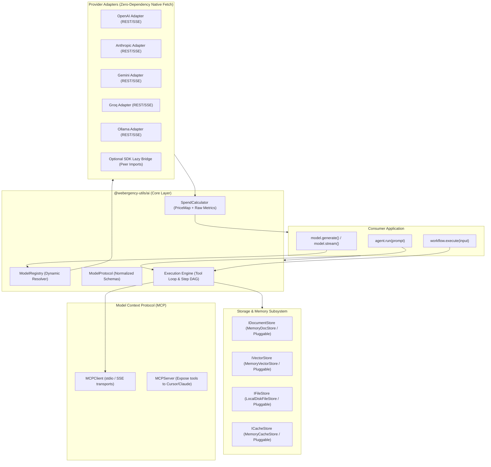

## Goal Capsule

- **Objective**: Deliver a high-performance, developer-first TypeScript AI toolkit (`@webergency-utils/ai`) providing low-level metal access and future-proof model abstractions across multimodal interactions, dynamic provider loading, multi-tier storage, caching, token spend calculation, MCP client/server tooling, and dual-layer agent/workflow orchestration.
- **Means**: Protocol-first core using zero-dependency native fetch/SSE by default with optional lazy vendor SDK bridges, coupled to abstract storage contracts and a durable checkpointed execution engine (KTD1, KTD3).
- **Product Authority**: Owned as the core runtime toolkit for the `@webergency-utils` ecosystem. Downstream domain agents and application services are contextual consumers, not active scope.
- **Execution Profile**: Standard TypeScript library built for Node.js (20+) and Bun, packaged as pure ESM with Vitest unit and integration suites.
- **Stop Conditions**: Implementation stops if an unresolvable native fetch streaming limitation on Node/Bun requires introducing heavyweight third-party network runtime dependencies into the core package.
- **Tail Ownership**: Developer documentation, CI/CD Scorecard pipelines, and npm packaging are governed by this plan.
- **Open Blockers**: None.

---

## Product Contract

*Product Contract unchanged.*

### Summary

A modular, unopinionated TypeScript AI toolkit for Node.js (20+) and Bun that unifies multimodal model interactions, dynamic provider imports, abstract storage contracts, and MCP support. It combines a zero-dependency streaming protocol core with a dual-layer autonomous agent and step workflow engine, capturing raw provider metrics for precise spend accounting.

### Problem Frame

Developers building AI agents and workflows in TypeScript face a painful dilemma:
1. High-level frameworks like LangChain and Mastra bundle massive dependency trees, enforce rigid abstractions, and frequently suffer breaking changes when AI labs update their APIs.
2. In-house experiments (such as the earlier `webergency/ai` prototype) proved that static provider imports cause module resolution failures and tight coupling, while ad-hoc tool-calling logic leaves stubs when extending beyond OpenAI.
3. Rapidly evolving provider capabilities (thinking/reasoning blocks, prompt caching, multimodal token formats, computer use) require a toolkit that is low-level enough to expose raw wire events and metadata directly, yet abstract enough that application code does not need rewrites with every provider release.

### Key Decisions

- **Lean protocol core with dynamic provider adapters**: Normalized messages and streaming events with a typed raw escape hatch for vendor-specific payloads, plus an interceptor pipeline for spend, cache, and storage (session-settled: user-approved — chosen over heavy class-based framework and functional stream transforms: balances low-level metal access with future-proofing against new AI lab capabilities). Governs R1, R2, R3.
- **Node.js (20+) and Bun backend-first target**: Full unconstrained access to native filesystem, child process stdio for MCP, streaming I/O, and server-side databases with strict TypeScript (session-settled: user-approved — chosen over universal cross-runtime: ensures robust backend tooling without lowest-common-denominator sandbox limitations). Governs R4, R5.
- **Pluggable registry with zero-dependency native fetch + optional SDK lazy imports**: Built-in native REST/SSE clients for instant cold starts and zero dependency bloat, plus lazy dynamic imports of official vendor SDKs if the consumer provides a pre-configured client instance (session-settled: user-approved — chosen over forced vendor SDK peer dependencies or pure HTTP-only engine: achieves maximum performance with optional SDK escape hatch). Governs R6, R7, R8.
- **Abstract storage contracts with Memory/Disk reference drivers**: Unified interfaces for Vector, File, Document, and Cache stores with built-in zero-external-dependency reference implementations, exposing pluggable contracts for PGVector, Redis, S3/R2, and SQLite (session-settled: user-approved — chosen over bundling heavy native DB drivers: prevents gigantic bundle sizes and dependency conflicts). Governs R9, R10, R11, R12.
- **Dual-layer Autonomous Agent + Typed Step Workflow Engine**: Lightweight Autonomous Agent for single-goal tool-calling loops plus a Typed Step-based Workflow Engine supporting DAGs, sequential/parallel steps, retries, and step events (session-settled: user-approved — chosen over tool loops only or heavy graph engines: delivers practical orchestration with durable checkpoints without excessive graph machinery). Governs R13, R14, R15, R16.
- **Both MCP Client & Server support**: First-class MCP client supporting stdio and SSE transports to consume external tools, paired with an MCP server utility to export local tools and agents to Claude Desktop or Cursor (session-settled: user-approved — chosen over client-only or server-only: enables both consuming external tools and publishing local tools/agents). Governs R17, R18.
- **Provider raw metrics for spend calculation**: Capture provider-reported token, cache, and reasoning metrics directly from API responses and compute spend against extensible pricing tables (session-settled: user-directed — chosen over synthetic media token estimators: guarantees 100% billing accuracy and immunity to tokenizer drift). Governs R19, R20, R21.
- **Strict Radixxko formatting and TypeScript standards**: Strictly enforce 4-space indentation, Allman braces, padded parentheses, colon-aligned types, and zero trailing commas across the codebase (session-settled: user-directed — chosen over standard Prettier/loose TS: adheres to repository 4-space Allman style, padded parens, and strict typing). Governs R22.

### Requirements

**Core Protocol & Model Layer**
- R1. The toolkit must define a normalized `ModelProtocol` interface for chat completion, multimodal input, and structured output generation.
- R2. The toolkit must support multimodal payloads (text, images, audio, video, PDFs) with automatic conversion to provider-specific payload schemas.
- R3. Every model response and stream chunk must expose a typed `raw` property containing the unaltered provider response or event payload.
- R4. The library must target Node.js 20+ and Bun runtimes using modern ECMAScript Modules (ESM) with clean subpath exports.
- R5. The core library must have zero required external dependencies outside of `zod` for schema validation.

**Dynamic Provider Registry & Streaming**
- R6. The provider registry must support dynamic resolution and initialization of providers (`openai`, `anthropic`, `gemini`, `groq`, `ollama`, `deepseek`, `mistral`) without static imports at boot.
- R7. The core must implement native zero-dependency HTTP/SSE streaming adapters using standard `fetch` and `TransformStream` for all supported providers.
- R8. When an optional official vendor SDK is explicitly requested via SDK bridge, the registry must dynamically import it lazily and fail with a clear, copy-pasteable installation hint if the package is missing.

**Multi-Tier Storage & Memory**
- R9. The toolkit must provide abstract interfaces for `IDocumentStore`, `IVectorStore`, `IFileStore`, and `ICacheStore`.
- R10. The toolkit must include built-in, zero-dependency in-memory reference implementations for all four storage interfaces (`MemoryDocStore`, `MemoryVectorStore`, `MemoryFileStore`, `MemoryCacheStore`).
- R11. The toolkit must include a local disk reference driver for `IFileStore` (`LocalDiskFileStore`) leveraging Node.js streams.
- R12. The toolkit must provide clean, pluggable adapter interfaces for external backends including PGVector, Redis, S3/Cloudflare R2, and SQLite/LibSQL.

**Agent & Workflow Orchestration**
- R13. The toolkit must provide an `Agent` abstraction supporting system prompts, tool collections, dynamic model binding, maximum loop limits, and guardrails.
- R14. The toolkit must provide a `Workflow` abstraction allowing developers to define step DAGs, sequential/parallel branches, typed step inputs/outputs, and retry policies.
- R15. The execution engine must serialize a durable `ICheckpoint` at every state transition (after LLM generation and after each tool call) to ensure crash recovery.
- R16. The workflow engine must support interrupt nodes (`WaitNode`) that suspend execution and resume when an external signal payload is provided.

**Model Context Protocol (MCP)**
- R17. The toolkit must provide an `MCPClient` supporting both `stdio` (child process) and `SSE` / HTTP streaming transports to discover and call external tools.
- R18. The toolkit must provide an `MCPServer` utility allowing developers to expose internal tools and agents as an MCP-compliant server.

**Spend Tracking & Observability**
- R19. The toolkit must extract exact provider-reported usage metrics (prompt tokens, completion tokens, cached prompt read/write tokens, reasoning tokens).
- R20. The toolkit must include an extensible pricing table (`PriceMap`) mapping provider models to USD costs per million tokens and cache operations.
- R21. The spend calculator must compute exact cost per call, thread, agent, and workflow run, with support for custom rate overrides and budget cap guardrails.

**Code Quality & Packaging**
- R22. All library code must strictly adhere to the Radixxko coding standard (4-space indentation, Allman braces, padded parentheses `( arg )`, colon-aligned types, and strict TypeScript types).

### Key Flows

- F1. Dynamic Model Execution with Raw Metric Capture and Spend Calculation
  - **Trigger:** Application calls `model.generate(messages, options)` or `model.stream(messages, options)`.
  - **Actors:** Application, Provider Registry, Provider Adapter, Spend Calculator.
  - **Steps:**
    1. Provider Registry lazily resolves adapter for target provider without static SDK import.
    2. Adapter normalizes input messages and multimodal attachments into provider-native format.
    3. Adapter sends HTTP request via native fetch and processes response or SSE stream.
    4. Adapter extracts raw provider usage metrics and attaches unaltered payload to `raw`.
    5. Spend Calculator evaluates raw metrics against `PriceMap` and attaches monetary cost.
  - **Covered by:** R1, R2, R3, R6, R7, R19, R20, R21.

- F2. Checkpointed Agent Tool Execution with JIT Discovery
  - **Trigger:** User sends a query to `agent.run(input, { threadId })`.
  - **Actors:** Agent, Engine, Checkpoint Store, Tool Store, LLM Provider.
  - **Steps:**
    1. Engine hydrates latest checkpoint for `threadId` from Document Store.
    2. If tool count exceeds context threshold, Tool Store queries Vector Store to retrieve most relevant tool schemas.
    3. Agent invokes model with message history and active tool schemas.
    4. Upon receiving tool calls, Engine executes tools and saves an intermediate checkpoint.
    5. Tool outputs are appended to history and the loop repeats until final answer or stop condition.
  - **Covered by:** R9, R10, R13, R15.

- F3. Human-in-the-Loop Step Workflow Execution and Resumption
  - **Trigger:** Workflow enters a designated `WaitNode` or interrupt step.
  - **Actors:** Workflow Runner, Checkpoint Store, External Consumer.
  - **Steps:**
    1. Workflow executes predecessor steps and persists intermediate state to Checkpoint Store.
    2. Workflow reaches `WaitNode`, emits `SUSPENDED` event with `runId`, and pauses execution.
    3. External consumer receives approval or external data and calls `workflow.resume(runId, signalData)`.
    4. Workflow hydrates state from checkpoint, injects `signalData`, and resumes next step in the DAG.
  - **Covered by:** R14, R15, R16.

- F4. MCP Server Export and Client Tool Consumption
  - **Trigger:** Developer exposes local agent tools to an MCP host or connects to an external MCP server.
  - **Actors:** MCPClient, MCPServer, External MCP Host/Server.
  - **Steps:**
    1. `MCPClient` connects to external server via stdio spawn or SSE URL, listing tools and schemas.
    2. Retrieved tools are mapped to native toolkit `Tool` instances and bound to an Agent.
    3. Alternatively, `MCPServer` registers local tools/agents and handles incoming JSON-RPC tool requests.
  - **Covered by:** R17, R18.

### Acceptance Examples

- AE1. Dynamic Provider Import with Missing Dependency
  - **Covers:** R6, R8.
  - **Given:** A project using `@webergency-utils/ai` with only `zod` installed.
  - **When:** Developer calls `createModel({ provider: 'anthropic', model: 'claude-3-7-sonnet', useNativeSDK: true })`.
  - **Then:** The toolkit attempts dynamic import of `@anthropic-ai/sdk`. If not installed, it throws a descriptive error: `Missing dependency: please install @anthropic-ai/sdk using 'npm install @anthropic-ai/sdk'`.

- AE2. Checkpoint Preservation on Tool Crash
  - **Covers:** R13, R15.
  - **Given:** An active agent thread executing three consecutive tool calls.
  - **When:** Tool 1 succeeds, Tool 2 executes and throws an unhandled exception or crash.
  - **Then:** Checkpoint store contains the saved output of Tool 1; subsequent thread runs can resume without re-running Tool 1.

- AE3. Multimodal Prompt Caching and Raw Spend Precision
  - **Covers:** R2, R3, R19, R20, R21.
  - **Given:** A multimodal request sent to Anthropic Claude 3.7 with a cached image attachment.
  - **When:** Anthropic returns `cache_read_input_tokens: 1600` and `input_tokens: 400`.
  - **Then:** Toolkit captures both raw metrics exactly, applies discounted cache read rate to 1,600 tokens and standard prompt rate to 400 tokens, and records exact USD cost.

- AE4. Resuming Suspended Workflow after External Signal
  - **Covers:** R14, R15, R16.
  - **Given:** A multi-step workflow paused at a human approval `WaitNode`.
  - **When:** Server process restarts and later receives `workflow.resume(runId, { approved: true })`.
  - **Then:** Workflow rehydrates from the checkpoint store and continues execution from the approved node without re-executing completed predecessor nodes.

### Scope Boundaries

**Deferred for later**
- Built-in connectors for secondary niche vector stores (e.g., Weaviate, Milvus, Vespa) — community adapters can implement `IVectorStore`.
- Graph visualizer or interactive web-based debugging GUI — CLI and programmatic event listeners are supported in v1.
- Specialized audio speech-to-text / text-to-speech pipelines — handled via multimodal model generation in v1.

**Outside this product's identity**
- Frontend UI components, chat widgets, or React bindings — the toolkit is strictly headless backend/CLI infrastructure.
- Bundled heavy native database drivers (`pg`, `ioredis`, `@aws-sdk/client-s3`) in core dependencies — provided exclusively through pluggable adapters to prevent dependency bloat.
- Hosted cloud telemetry SaaS or proprietary tracing backends — telemetry is emitted locally through typed interceptors and events.

### Dependencies / Assumptions

- Target environment is Node.js 20+ or Bun supporting native `fetch`, `TransformStream`, and ES Modules.
- `zod` is the only core dependency for runtime schema validation and tool parameter definitions.
- Official provider SDKs (`openai`, `@anthropic-ai/sdk`, `@google/genai`, `ollama`) remain optional peer dependencies loaded dynamically.

### Outstanding Questions

- **Resolve Before Planning**: None.
- **Deferred to Planning**:
  - Evaluation of whether `sqlite-vec` or `libsql` should be provided as an optional first-party package or standalone recipe.
  - Exact subpath export layout (`@webergency-utils/ai`, `@webergency-utils/ai/mcp`, `@webergency-utils/ai/storage`).

### Sources / Research

- Reference prototype in `webergency/ai` (`src/classes/agent.ts`, `src/classes/internal/checkpoint.ts`, `src/classes/internal/engine.ts`, `docs/project.md`).
- Mastra core architecture (`@mastra/core`) for agent/workflow design paradigms.
- Model Context Protocol (MCP) TypeScript SDK and specification.
- Radixxko coding guidelines in `docs/AGENT_CODING_GUIDELINES.md`.

---

## Planning Contract

### Key Technical Decisions

- KTD1. **Stateless Protocol Engine with Typed Raw Escape Hatch**: The core model layer communicates over normalized TypeScript interfaces (`ModelRequest`, `ModelResponse`, `ModelStreamChunk`) while preserving the provider's original wire payload on a `raw` property. Rationale: gives developers immediate access to newly released model features (reasoning tokens, search results, computer use) without library updates. (session-settled: user-approved — chosen over heavy class-based framework and functional stream transforms: balances low-level metal access with future-proofing against new AI lab capabilities). Governs R1, R2, R3.
- KTD2. **Zero-Dependency Native SSE / Streaming Pipeline**: Model streaming is implemented with standard `fetch` response bodies, `TransformStream`, and async iterators (`AsyncIterable<ModelStreamChunk>`), avoiding heavy HTTP client packages or Node event emitter wrappers. Rationale: eliminates runtime bloat and ensures instant cold starts across Node 20+ and Bun. Governs R4, R5, R7.
- KTD3. **Decoupled Dynamic Provider Registry**: The core never statically imports any vendor code. Models are resolved dynamically on demand via `ModelRegistry.resolve(providerId, config)`. Rationale: directly resolves the import deadlock identified in `webergency/ai` where static imports prevented adding Ollama/Gemini. Governs R6, R8.
- KTD4. **Pluggable Storage Contracts with In-Memory Reference Implementations**: Storage interfaces (`IDocumentStore`, `IVectorStore`, `IFileStore`, `ICacheStore`) are pure TypeScript abstract classes/interfaces. The core package ships with memory and local disk drivers; external drivers (PGVector, Redis, S3) are defined as interface adapters to keep core dependencies zero-bloat. (session-settled: user-approved — chosen over bundling heavy native DB drivers: prevents gigantic bundle sizes and dependency conflicts). Governs R9, R10, R11, R12.
- KTD5. **Step-Based DAG Engine with Transition Checkpoints**: Workflows are compiled into directed execution DAGs. The execution runner executes steps sequentially or concurrently, persisting an `ICheckpoint` to the `IDocumentStore` after every step and tool invocation. Rationale: guarantees crash recovery and non-loss of expensive LLM/tool operations. Governs R14, R15, R16.
- KTD6. **Transport-Agnostic Model Context Protocol Integration**: MCP is split into an `MCPClient` (supporting stdio child-process pipes and HTTP SSE streams) that projects remote tools into native `Tool` instances, and an `MCPServer` that exposes local toolkit tools/agents over stdio/SSE. (session-settled: user-approved — chosen over client-only or server-only: enables both consuming external tools and publishing local tools/agents). Governs R17, R18.
- KTD7. **Provider Raw Metric Normalization for Spend Calculation**: Token usage is read directly from provider response payloads (`usage.prompt_tokens`, `usage.completion_tokens_details.reasoning_tokens`, `usage.prompt_tokens_details.cached_tokens`, etc.) and multiplied against a typed `PriceMap`. Rationale: eliminates synthetic token estimator inaccuracy and guarantees exact financial attribution. (session-settled: user-directed — chosen over synthetic media token estimators: guarantees 100% billing accuracy and immunity to tokenizer drift). Governs R19, R20, R21.
- KTD8. **Strict Radixxko TypeScript and Formatting Standards**: Universal enforcement of 4-space indentation, Allman bracing, padded parentheses `( arg )`, colon-aligned types, strict ESM exports, and Vitest test suites. Governs R22.

### High-Level Technical Design



### Output Structure

```
webergency-utils/ai/
├── package.json
├── tsconfig.json
├── eslint.config.js
├── vitest.config.ts
├── src/
│   ├── index.ts                     # Main entrypoint & exports
│   ├── core/
│   │   ├── protocol.ts              # ModelProtocol, ModelRequest, ModelResponse, StreamChunk
│   │   ├── types.ts                 # Message, Role, Attachment, Multimodal types
│   │   ├── error.ts                 # Typed toolkit errors & dependency hints
│   │   └── stream.ts                # SSE & TransformStream utilities
│   ├── providers/
│   │   ├── registry.ts              # ModelRegistry (dynamic adapter loader & cache)
│   │   ├── base.ts                  # BaseProviderAdapter abstract class
│   │   ├── openai.ts                # OpenAI native fetch adapter
│   │   ├── anthropic.ts             # Anthropic native fetch adapter
│   │   ├── gemini.ts                # Google Gemini native fetch adapter
│   │   ├── groq.ts                  # Groq native fetch adapter
│   │   ├── ollama.ts                # Ollama native fetch adapter
│   │   └── sdk-bridge.ts            # Optional lazy vendor SDK bridge
│   ├── storage/
│   │   ├── index.ts                 # Storage contracts export
│   │   ├── document.ts              # IDocumentStore interface & MemoryDocStore
│   │   ├── vector.ts                # IVectorStore interface & MemoryVectorStore
│   │   ├── file.ts                  # IFileStore interface & LocalDiskFileStore
│   │   └── cache.ts                 # ICacheStore interface & MemoryCacheStore
│   ├── spend/
│   │   ├── calculator.ts            # SpendCalculator engine
│   │   ├── pricing.ts               # Extensible PriceMap & default rate tables
│   │   └── tracker.ts               # Run/Thread/Agent spend aggregator
│   ├── mcp/
│   │   ├── index.ts                 # MCP client & server exports
│   │   ├── client.ts                # MCPClient (stdio & SSE transports)
│   │   ├── server.ts                # MCPServer utility
│   │   └── types.ts                 # MCP protocol schemas & mappings
│   ├── agent/
│   │   ├── agent.ts                 # Autonomous Agent class
│   │   ├── tool.ts                  # Tool definition & schema validation
│   │   ├── jit-retriever.ts         # JIT Tool discovery via IVectorStore
│   │   └── checkpoint.ts            # Durable checkpoint serialization & restore
│   └── workflow/
│       ├── workflow.ts              # Workflow definition builder (DAG)
│       ├── runner.ts                # Step DAG execution runner & interrupts
│       ├── nodes.ts                 # AgentNode, ToolNode, WaitNode, ConditionNode
│       └── events.ts                # Workflow step events & listeners
└── tests/
    ├── core/protocol.test.ts
    ├── providers/openai.test.ts
    ├── providers/anthropic.test.ts
    ├── providers/gemini.test.ts
    ├── storage/memory-stores.test.ts
    ├── storage/disk-store.test.ts
    ├── spend/calculator.test.ts
    ├── mcp/client-server.test.ts
    ├── agent/agent-loop.test.ts
    └── workflow/workflow-dag.test.ts
```

### Assumptions & Constraints

- Node.js 20+ or Bun runtime environment.
- Strict Radixxko TypeScript rules enforced everywhere (4 spaces, Allman braces, padded parens, colon-aligned types).
- Vitest used as the test runner for fast ESM execution with coverage thresholds.
- Only `zod` installed as a direct production dependency; all vendor SDKs and database drivers are optional peer dependencies.

---

## Implementation Units

### U1. Core Package Scaffolding & Radixxko TypeScript Config
- **Goal**: Initialize the package repository with strict TypeScript 5.8+, ESLint matching Radixxko formatting, Vitest test configuration, and modern ESM subpath exports.
- **Requirements**: R4, R5, R22.
- **Dependencies**: None.
- **Files**:
  - `package.json`
  - `tsconfig.json`
  - `eslint.config.js`
  - `vitest.config.ts`
  - `src/index.ts`
- **Approach**:
  1. Configure `package.json` with `@webergency-utils/ai`, ESM (`"type": "module"`), subpath exports (`.`, `./mcp`, `./storage`, `./providers`), scripts (`build`, `test`, `lint`).
  2. Configure `tsconfig.json` with target `ES2022`, module `NodeNext`, strict mode, declaration generation.
  3. Configure `eslint.config.js` enforcing Radixxko rules (4 spaces, Allman braces, padded parens, colon-alignment).
  4. Scaffold `src/index.ts` barrel file.
- **Test scenarios**:
  - Validates `npm run build` compiles cleanly to `dist/` with `.d.ts` declaration maps.
  - Validates `npm run lint` passes without style errors.
- **Verification**: `npm run lint && npm run build` completes with exit code 0.

### U2. Model Protocol, Normalized Streaming & Raw Telemetry Pipeline
- **Goal**: Define the normalized `ModelProtocol`, request/response types, multimodal attachments, and zero-dependency SSE stream parser.
- **Requirements**: R1, R2, R3, R5, R7.
- **Dependencies**: U1.
- **Files**:
  - `src/core/protocol.ts`
  - `src/core/types.ts`
  - `src/core/stream.ts`
  - `src/core/error.ts`
  - `tests/core/protocol.test.ts`
- **Approach**:
  1. Define `ModelRequest`, `ModelResponse`, `ModelStreamChunk`, `Message`, and `Attachment` (image, audio, video, PDF).
  2. Ensure every response and chunk carries a typed `raw: unknown` property containing the unaltered provider response.
  3. Implement `parseSSEStream` using native `TransformStream` and async iterators to parse event streams into structured chunks.
  4. Create typed error classes (`ProviderError`, `RateLimitError`, `MissingDependencyError`) with clear developer messages.
- **Test scenarios**:
  - Parse multi-line SSE events into distinct chunks with correct text deltas.
  - Correctly preserve unaltered provider payload on `raw` property.
  - Verify error handling on malformed stream buffers or network disconnects.
- **Verification**: `npx vitest run tests/core/protocol.test.ts` passes with 100% assertion success.

### U3. Dynamic Provider Registry & Zero-Dependency Native Fetch Adapters
- **Goal**: Implement dynamic provider resolution and native REST/SSE HTTP adapters for OpenAI, Anthropic, Gemini, Groq, and Ollama.
- **Requirements**: R1, R2, R6, R7.
- **Dependencies**: U2.
- **Files**:
  - `src/providers/registry.ts`
  - `src/providers/base.ts`
  - `src/providers/openai.ts`
  - `src/providers/anthropic.ts`
  - `src/providers/gemini.ts`
  - `src/providers/groq.ts`
  - `src/providers/ollama.ts`
  - `tests/providers/openai.test.ts`
  - `tests/providers/anthropic.test.ts`
  - `tests/providers/gemini.test.ts`
- **Approach**:
  1. Define `BaseProviderAdapter` interface with `generate()` and `stream()` signatures.
  2. Implement `ModelRegistry` mapping provider slugs to lazy adapter instances without static vendor imports.
  3. Implement native `fetch` payload serializers and response parsers for each provider (OpenAI Chat Completions, Anthropic Messages, Gemini generateContent, Groq, Ollama).
  4. Support multimodal payload encoding (base64 inline media and remote URLs).
- **Test scenarios**:
  - Resolve `openai` and generate payload matching OpenAI `/v1/chat/completions` schema without vendor SDK.
  - Resolve `anthropic` and parse Claude streaming SSE events with thinking/reasoning blocks.
  - Resolve `gemini` and convert multimodal images into `inlineData` parts.
  - Dynamic import tests: verify registry instantiates adapters on first call and caches them.
- **Verification**: `npx vitest run tests/providers/*.test.ts` passes all mocked HTTP adapter specs.

### U4. Optional Vendor SDK Lazy Bridges & Error Diagnostics
- **Goal**: Provide an optional bridge to use official vendor SDK instances (`openai`, `@anthropic-ai/sdk`, `@google/genai`) lazily, with explicit installation hints on failure.
- **Requirements**: R6, R8.
- **Dependencies**: U3.
- **Files**:
  - `src/providers/sdk-bridge.ts`
  - `tests/providers/sdk-bridge.test.ts`
- **Approach**:
  1. Implement `loadVendorSDK(packageName)` using dynamic `import(packageName)`.
  2. Catch `ERR_MODULE_NOT_FOUND` / `MODULE_NOT_FOUND` and throw `MissingDependencyError` with exact command `npm install <package>`.
  3. Wrap official SDK client calls into normalized `ModelResponse` and stream chunks.
- **Test scenarios**:
  - Covers AE1: Attempt to load missing package and assert thrown error message matches installation instructions.
  - Pass pre-instantiated SDK instance and verify seamless execution.
- **Verification**: `npx vitest run tests/providers/sdk-bridge.test.ts` passes.

### U5. Multi-Tier Storage Abstractions & In-Memory/Disk Reference Drivers
- **Goal**: Implement abstract contracts and reference implementations for DocumentStore, VectorStore, FileStore, and CacheStore.
- **Requirements**: R9, R10, R11, R12.
- **Dependencies**: U1.
- **Files**:
  - `src/storage/index.ts`
  - `src/storage/document.ts`
  - `src/storage/vector.ts`
  - `src/storage/file.ts`
  - `src/storage/cache.ts`
  - `tests/storage/memory-stores.test.ts`
  - `tests/storage/disk-store.test.ts`
- **Approach**:
  1. Define `IDocumentStore` (`get`, `put`, `list`, `delete`), `IVectorStore` (`upsert`, `search`, `delete`), `IFileStore` (`read`, `write`, `delete`, `exists`), `ICacheStore` (`get`, `set`, `has`, `delete`).
  2. Implement `MemoryDocStore`, `MemoryCacheStore` (with TTL/LRU), and `MemoryVectorStore` (with exact cosine similarity).
  3. Implement `LocalDiskFileStore` using Node.js filesystem streams.
  4. Provide type adapters for external DB connectors (PGVector, Redis, S3/R2).
- **Test scenarios**:
  - Vector search returns top-K nearest neighbors sorted by cosine similarity.
  - DocumentStore retrieves, updates, and deletes structured documents.
  - CacheStore honors TTL expiration and eviction policies.
  - LocalDiskFileStore writes and reads binary/text streams safely.
- **Verification**: `npx vitest run tests/storage/*.test.ts` passes.

### U6. Dynamic Spend Calculator, Token Extraction & Pricing Engine
- **Goal**: Extract provider raw usage metrics and compute USD costs with built-in pricing tables and custom rate overrides.
- **Requirements**: R19, R20, R21.
- **Dependencies**: U2, U3.
- **Files**:
  - `src/spend/pricing.ts`
  - `src/spend/calculator.ts`
  - `src/spend/tracker.ts`
  - `tests/spend/calculator.test.ts`
- **Approach**:
  1. Define `PriceMap` registry with prices per 1M tokens for OpenAI, Anthropic, Gemini, Groq, DeepSeek models.
  2. Extract raw provider usage details: prompt tokens, completion tokens, reasoning tokens, cached read/write tokens.
  3. Implement `calculateSpend(usage, modelId, pricingOverrides)` calculating exact cost.
  4. Implement `SpendTracker` to aggregate costs by `threadId`, `agentId`, and `runId`.
- **Test scenarios**:
  - Covers AE3: Verify cached prompt token discounts are accurately calculated for Claude 3.7.
  - Verify reasoning tokens in OpenAI o1/o3-mini are computed at completion rates.
  - Verify budget cap threshold emits a warning or throws when exceeded.
- **Verification**: `npx vitest run tests/spend/calculator.test.ts` passes with verified precision.

### U7. Model Context Protocol (MCP) Client & Server Transports
- **Goal**: Implement an MCP client (stdio child-process & SSE) to consume external tools, and an MCP server utility to export local tools/agents.
- **Requirements**: R17, R18.
- **Dependencies**: U2.
- **Files**:
  - `src/mcp/index.ts`
  - `src/mcp/client.ts`
  - `src/mcp/server.ts`
  - `src/mcp/types.ts`
  - `tests/mcp/client-server.test.ts`
- **Approach**:
  1. Implement `MCPClient` with `StdioTransport` (spawning child process) and `SSETransport` (connecting to remote HTTP endpoint).
  2. Map MCP tools to native toolkit `Tool` objects with Zod schemas.
  3. Implement `MCPServer` that exposes registered local tools over stdio/SSE according to MCP JSON-RPC 2.0 protocol.
- **Test scenarios**:
  - Connect to a mock stdio MCP process, list tools, and invoke a tool call.
  - Start an `MCPServer`, register a local math tool, send a JSON-RPC request and verify output.
- **Verification**: `npx vitest run tests/mcp/client-server.test.ts` passes.

### U8. Durable Memory Checkpoint Engine & JIT Tool Registry
- **Goal**: Implement durable step checkpointing and Just-In-Time semantic tool retrieval for agents.
- **Requirements**: R9, R13, R15.
- **Dependencies**: U5.
- **Files**:
  - `src/agent/checkpoint.ts`
  - `src/agent/jit-retriever.ts`
  - `src/agent/tool.ts`
  - `tests/agent/checkpoint.test.ts`
- **Approach**:
  1. Implement `CheckpointManager` that serializes execution states to `IDocumentStore`.
  2. Implement `JITToolRetriever` that indexes tools in an `IVectorStore` and performs semantic search to dynamically inject relevant tool schemas when tool count exceeds threshold.
  3. Define `Tool` class with name, description, Zod schema, and execution handler.
- **Test scenarios**:
  - Covers AE2: Execute multi-tool pipeline; simulate crash during tool 2; verify tool 1 checkpoint state is preserved.
  - Index 20 mock tools; query with "weather"; verify only weather-related tool schemas are retrieved.
- **Verification**: `npx vitest run tests/agent/checkpoint.test.ts` passes.

### U9. Autonomous Agent & Typed Step Workflow Engine
- **Goal**: Implement the dual-layer orchestration: lightweight autonomous Agent tool-calling loop and typed step Workflow DAG engine with interrupts.
- **Requirements**: R13, R14, R15, R16.
- **Dependencies**: U3, U6, U8.
- **Files**:
  - `src/agent/agent.ts`
  - `src/workflow/workflow.ts`
  - `src/workflow/runner.ts`
  - `src/workflow/nodes.ts`
  - `src/workflow/events.ts`
  - `tests/agent/agent-loop.test.ts`
  - `tests/workflow/workflow-dag.test.ts`
- **Approach**:
  1. Implement `Agent` with `generate()`, `stream()`, tool loop, maximum step guardrails, and spend tracking hooks.
  2. Implement `Workflow` builder with `.addStep()`, `.addWaitNode()`, `.addCondition()`, `.addEdge()`.
  3. Implement `WorkflowRunner` executing steps, emitting lifecycle events (`STEP_START`, `STEP_COMPLETE`, `SUSPENDED`), saving checkpoints, and handling `workflow.resume(runId, signal)`.
- **Test scenarios**:
  - Agent executes tool call, receives result, and produces final completion.
  - Covers AE4: Multi-step workflow pauses at `WaitNode`, enters `SUSPENDED` state, and resumes successfully when `resume()` is called with external signal data.
- **Verification**: `npx vitest run tests/agent/agent-loop.test.ts tests/workflow/workflow-dag.test.ts` passes.

### U10. Package Exports, End-to-End Test Suite & CI/Scorecard Integration
- **Goal**: Unify all public exports in `src/index.ts`, author end-to-end integration tests, and set up GitHub Actions CI workflow with linting, type-checking, and testing.
- **Requirements**: R4, R5, R22.
- **Dependencies**: U1 through U9.
- **Files**:
  - `src/index.ts`
  - `.github/workflows/ci.yml`
  - `tests/e2e/toolkit.test.ts`
  - `README.md`
- **Approach**:
  1. Cleanly export all core primitives, providers, storage drivers, MCP utilities, agent, and workflow classes.
  2. Create comprehensive E2E test exercising model generation, spend tracking, memory checkpointing, and workflow execution.
  3. Create `.github/workflows/ci.yml` running Node 20 & 22 matrix with lint, typecheck, and test commands.
  4. Write `README.md` following `@webergency-utils` standard.
- **Test scenarios**:
  - Full E2E test combining Model -> Tool -> Agent -> Checkpoint -> Spend calculation.
  - Package builds cleanly into `dist/` with valid ESM exports and type definitions.
- **Verification**: `npm run lint && npm test && npm run build` completes with 100% pass rate.

---

## Verification Contract

### Commands

```bash
# Run linting across all files according to Radixxko rules
npm run lint

# Run full test suite with Vitest
npm test

# Run build to ensure type declarations and ESM bundles compile cleanly
npm run build
```

### Quality Gates

- **Linting & Formatting**: 100% compliance with Radixxko rules (Allman braces, 4-space indent, padded parens, colon-aligned types).
- **TypeScript**: `tsc --noEmit` exits with 0 errors under `strict: true`.
- **Unit & Integration Test Coverage**: Minimum 85% branch coverage across core protocol, registry, spend engine, storage, and workflow runner.
- **Zero Heavy Core Dependencies**: `package.json` dependencies must contain ONLY `zod`.

---

## Definition of Done

- All 10 Implementation Units (`U1` to `U10`) are implemented, passing their enumerated test scenarios.
- All 22 Requirements (`R1` to `R22`) and Acceptance Examples (`AE1` to `AE4`) are fully verified.
- Core package runs on Node 20+ and Bun with clean ESM subpath exports (`@webergency-utils/ai`, `@webergency-utils/ai/mcp`, `@webergency-utils/ai/storage`).
- All code strictly adheres to Radixxko formatting and quality conventions.
- No abandoned, commented-out, or stubbed code exists in `src/`.
- CI workflow is configured and passes.
