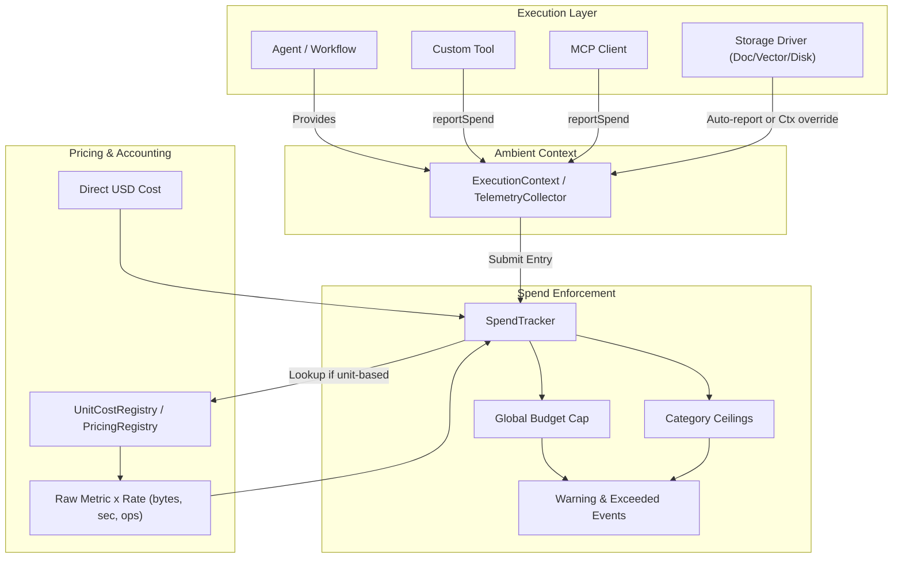
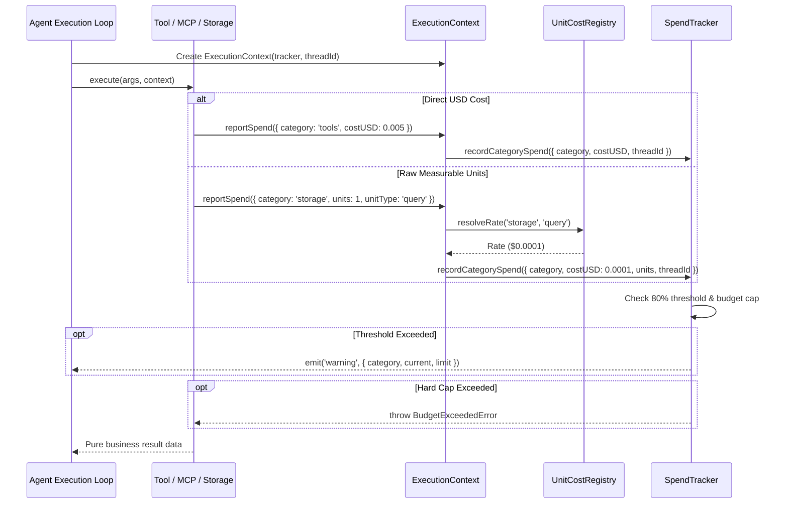

# Multi-Category Spend & Telemetry - Plan

## Goal Capsule

- **Objective:** Enable applications, agents, and workflows to track, aggregate, and enforce budgets across all operational cost categories—model inference, vector/document storage, compute sandbox runtime, network transport, MCP tool invocations, and custom third-party APIs—via ambient telemetry hooks and unit rate resolution.
- **Means:** Ambient `ExecutionContext` reporting into `SpendTracker` with `UnitCostRegistry` dynamic metric resolution and dual-level storage metering (KTD1, KTD2).
- **Product Authority:** `ce-brainstorm`
- **Open Blockers:** None

---

## Product Contract

**Product Contract preservation:** Product Contract unchanged.

### Summary

A unified multi-category spend and telemetry system for `@webergency-utils/ai` that tracks model inference, storage operations, compute runtime, network transport, MCP calls, and custom tools in tandem. Operations report costs ambiently via an execution context using direct USD or raw measurable units resolved through a category unit cost registry, with dual-level storage metering and tiered budget enforcement.

### Problem Frame

In real-world AI applications and agentic platforms, model token inference represents only a fraction of total operating costs. Running production agents incurs vector database search fees, document storage retention, code execution sandbox runtime, egress bandwidth, paid external search APIs, and remote MCP tool calls. 

Currently, the toolkit's `SpendTracker` and `SpendCalculator` only calculate and enforce budgets on LLM token usage (`promptTokens`, `completionTokens`, `cachedPromptReadTokens`). Storage drivers, MCP clients, and tools execute without cost reporting, forcing developers to build fragmented custom bookkeeping or leave infrastructure vulnerable to unmonitored cost blowouts.

### Key Decisions

- **Ambient context and telemetry hooks over enveloped return values** (session-settled: user-directed — chosen over enveloped results and automatic proxy middleware: preserves pure business return values across all existing tools, MCP handlers, and storage interfaces without breaking signatures). Governs R4, R5, R6.
- **Hybrid reporting (raw units or explicit USD) over direct USD only** (session-settled: user-directed — chosen over direct USD only: allows native throughput metrics like bytes, seconds, and queries to resolve dynamically via a unit cost registry while supporting tools that return exact third-party billing costs). Governs R2, R3, R9, R10.
- **Dual-level storage metering over per-call-only** (session-settled: user-directed — chosen over per-call context only and separate decorator wrappers: enables zero-boilerplate automatic metering at the store instance level while supporting optional per-call thread attribution). Governs R7, R8.
- **Unified global budget cap with optional category limits and soft warning events** (session-settled: user-directed — chosen over global hard cap only and isolated category caps: provides total financial protection while giving early visibility into runaway category spikes before halting execution). Governs R11, R12, R13.

### Visualizations

### Requirements

#### Telemetry Categories & Measurement Models

- R1. The system must support a standard taxonomy of first-class cost categories: `model`, `storage`, `compute`, `network`, `mcp`, `tools`, and `custom`.
- R2. Cost entries must accept explicit USD amounts (`costUSD: number`) or measurable unit quantities (`units: number`, `unitType: string`) accompanied by optional subcategory and metadata tags.
- R3. Standard unit types must include `bytes` (storage & transport), `operations` / `queries` (database operations), `durationMs` / `seconds` (compute & connection runtime), and `records` (document batch counts).

#### Ambient Execution Context & Reporter Hooks

- R4. Tool execution definitions (`Tool`, `createTool`) must accept an optional `ExecutionContext` parameter passed to the tool's execute function without changing tool output values.
- R5. `MCPClient.callTool` must accept an optional `ExecutionContext` to report transport egress/ingress bytes and tool execution fees.
- R6. The `ExecutionContext` must provide a thread-safe `reportSpend(entry: CategorySpendInput)` method and access to current thread/agent attribution IDs.

#### Storage & Database Telemetry Wiring

- R7. Storage driver constructors (`MemoryDocStore`, `MemoryVectorStore`, `MemoryFileStore`, `LocalDiskFileStore`, `MemoryCacheStore`) must accept an optional default `SpendTracker` and `storagePricing` configuration for automatic operation metering.
- R8. Store CRUD and query methods must accept an optional `context?: ExecutionContext` option that overrides default attribution and routes operational spend to the active caller's thread or agent.

#### Unit Cost Registry & Dynamic Pricing Resolution

- R9. The system must provide a `UnitCostRegistry` that maps category/subcategory unit rates (e.g. `storage:vector_query` -> `$0.0001 per query`, `storage:file_write` -> `$0.02 per GB`, `compute:sandbox` -> `$0.00005 per second`).
- R10. The `UnitCostRegistry` must support manual overrides, batch updates, and price change event subscriptions (`registry.on('change', listener)`).

#### Unified Spend Tracking & Tiered Budget Enforcement

- R11. `SpendTracker` must aggregate both model token spend and non-model category spend into a unified `totalSpendUSD` and expose category breakdowns (`categorySpend: Record<SpendCategory, number>`).
- R12. `SpendTracker` must support configurable budget configurations: global aggregate limit (`maxBudgetUSD`) and optional per-category ceilings (`categoryBudgets: Partial<Record<SpendCategory, number>>`).
- R13. `SpendTracker` must emit non-blocking `warning` events when cumulative or category spend exceeds a configurable threshold percentage (default 80%) and throw `BudgetExceededError` when any hard cap is breached.

### Key Flows

- F1. Tool reporting direct third-party API spend
  - **Trigger:** An agent executes a search tool that calls an external paid API.
  - **Actors:** Agent, Tool execute function, `ExecutionContext`, `SpendTracker`.
  - **Steps:** The agent supplies the active `ExecutionContext` to the tool; the tool performs the external call; the tool calls `ctx.reportSpend({ category: 'tools', subcategory: 'web_search', costUSD: 0.005 })`; the tool returns its pure string data to the agent.
  - **Outcome:** The tool returns clean business data, while `$0.005` is recorded in `SpendTracker` under category `tools`.
  - **Covers R2, R4, R6, R11.**

- F2. Metered vector query with unit rate resolution
  - **Trigger:** An agent queries `IVectorStore` for relevant document chunks.
  - **Actors:** Agent, `IVectorStore`, `UnitCostRegistry`, `SpendTracker`.
  - **Steps:** Vector store receives `query(vector, { topK: 5, context: ctx })`; store executes cosine similarity search; store calculates 1 query operation; store calls `ctx.reportSpend({ category: 'storage', subcategory: 'vector_query', units: 1, unitType: 'query' })`; tracker resolves `$0.0001` from `UnitCostRegistry` and accumulates it.
  - **Outcome:** Vector results return unchanged; store operation is metered and attributed to the active thread.
  - **Covers R3, R7, R8, R9.**

- F3. Tiered budget warning and enforcement
  - **Trigger:** Cumulative spend approaches and exceeds configured budget caps.
  - **Actors:** `SpendTracker`, Application listeners, Executing Agent.
  - **Steps:** Spend hits 80% of `maxBudgetUSD` or category ceiling; tracker emits `'warning'` event; application logs alert or sheds non-critical tool calls; spend exceeds 100% of cap; tracker throws `BudgetExceededError`; agent loop catches error, halts gracefully, and persists checkpoint.
  - **Outcome:** Early visibility via soft warnings prevents surprise dropouts, while hard ceilings prevent financial runaway.
  - **Covers R11, R12, R13.**

### Acceptance Examples

- AE1. Third-party tool spend reporting
  - **Covers R2, R4, R6.**
  - **Given:** A tool created with `createTool` that calls `context.reportSpend({ category: 'tools', costUSD: 0.01 })`.
  - **When:** An agent invokes the tool with an active `ExecutionContext`.
  - **Then:** The tool returns its business result unchanged, and `tracker.getCategorySpend('tools')` increases by exactly `0.01`.

- AE2. Automatic vector storage metering
  - **Covers R7, R8, R9.**
  - **Given:** A `MemoryVectorStore` configured with a tracker and a unit cost of `$0.05` per 1,000 queries.
  - **When:** 20 vector searches are performed with `context`.
  - **Then:** `tracker.getCategorySpend('storage')` increases by `$0.001` (20 * 0.05 / 1000).

- AE3. Category budget breach enforcement
  - **Covers R12, R13.**
  - **Given:** A tracker configured with `maxBudgetUSD: 10.00` and `categoryBudgets: { compute: 1.00 }`.
  - **When:** Cumulative compute spend reaches `$1.01` while total spend is `$3.00`.
  - **Then:** The tracker throws `BudgetExceededError` specifying that the `compute` category budget was exceeded, despite total spend being well under `$10.00`.

### Scope Boundaries

#### Deferred for later

- Streaming transport metering for real-time WebSockets / SSE connection duration billing.
- Database storage retention continuous time billing (GB-month background counters).
- Automatic code sandbox CPU/memory runtime profiling (E2B / Docker cgroup integrations).

#### Outside this product's identity

- End-user billing, invoicing, Stripe webhooks, or credit card collection.
- Distributed OpenTelemetry collector OTLP daemon exporter (library stays pure, zero-dependency ESM).

### Dependencies / Assumptions

- Assumes existing `SpendTracker` in `src/spend/tracker.ts` can be extended backwards-compatibly without breaking existing `record(model, usage, options)` signatures.
- Assumes `Tool.execute` in `src/agent/tool.ts` can take an optional second argument `context?: ExecutionContext` while retaining full compatibility with existing single-argument `(args) => ...` tools.
- Assumes zero third-party dependencies are required to measure bytes, timestamps, and counts.

---

## Planning Contract

### Key Technical Decisions

- KTD1. Plain interface `ExecutionContext` with thread-safe reporting (session-settled: user-directed — chosen over class hierarchy or global async local storage: zero runtime overhead, explicit pass-through, and effortless mockability in unit tests). Governs R4, R5, R6.
- KTD2. Dedicated `UnitCostRegistry` separate from token `PricingRegistry` with shared event semantics (session-settled: user-directed — chosen over merging unit pricing into token pricing table: keeps token pricing clean while allowing fine-grained units like `bytes`, `queries`, `durationMs`, and `records`). Governs R2, R3, R9, R10.
- KTD3. Non-breaking optional context parameter on `Tool.execute(args, context?)` and store methods (session-settled: user-directed — chosen over mandatory context or breaking existing tool signatures: full backwards compatibility with existing tools and test suites). Governs R4, R7, R8.
- KTD4. Compound budget evaluation and threshold warning events in `SpendTracker` (session-settled: user-directed — chosen over separate budget manager class: keeps budget checking atomic on every spend record while dispatching non-blocking `warning` events before throwing `BudgetExceededError`). Governs R11, R12, R13.

### High-Level Technical Design

### System-Wide Impact

- **Public API Continuity:** Existing tools defined as `createTool({ execute: async (args) => ... })` continue to work with zero code modifications; the new `context` argument is optional.
- **Zero Dependency Overhead:** Pure native math and event sets; no external telemetry agents, daemons, or heavy dependencies.
- **Thread Safety & Multi-Tenancy:** Each `ExecutionContext` is bound to a specific `threadId` and optional `agentId`, enabling thread-isolated spend tracking through `SpendTracker.getThreadTracker(threadId)`.

### Assumptions

- The `UnitCostRegistry` initializes with reasonable default rates (e.g., `$0.0001` per vector query, `$0.02` per GB written) that can be overridden at runtime.
- In-memory event subscriptions (`on('warning', listener)`) use zero-dependency typed sets matching `PricingRegistry`.

---

## Implementation Units

### U1. Telemetry Data Contracts & Category Types

- **Goal:** Define the standard category types, unit types, and telemetry input/output data interfaces.
- **Requirements:** R1, R2, R3.
- **Dependencies:** None.
- **Files:** `src/spend/types.ts`, `src/spend/index.ts`, `tests/spend/types.test.ts`.
- **Approach:**
  1. Create `src/spend/types.ts` defining `SpendCategory = 'model' | 'storage' | 'compute' | 'network' | 'mcp' | 'tools' | 'custom'`.
  2. Define `CategorySpendInput` (category, subcategory, costUSD, units, unitType, metadata).
  3. Define `CategorySpendRecord` (id, timestamp, threadId, agentId, category, subcategory, costUSD, units, unitType, metadata).
  4. Extend `SpendBreakdown` to include optional `categorySpend: Record<SpendCategory, number>`.
  5. Re-export in `src/spend/index.ts`.
- **Patterns to follow:** `src/spend/pricing.ts` interfaces and Radixxko Allman formatting.
- **Test Scenarios:**
  - Happy path: Validate category spend records with explicit USD and with measurable unit types.
  - Edge cases: Custom category string tags and optional metadata dictionaries.
- **Verification:** Unit test suite passing with full type validation.

### U2. Ambient ExecutionContext & Tool Reporter Hooks

- **Goal:** Implement `ExecutionContext` and wire `Tool` execution signatures to receive it transparently.
- **Requirements:** R4, R6.
- **Dependencies:** U1.
- **Files:** `src/agent/context.ts`, `src/agent/tool.ts`, `src/agent/index.ts`, `tests/agent/context-tool.test.ts`.
- **Approach:**
  1. Create `src/agent/context.ts` with `ExecutionContext` interface and `SimpleExecutionContext` implementation.
  2. Implement `reportSpend(entry: CategorySpendInput): void` on `ExecutionContext` delegating to tracker.
  3. Update `Tool<T>` in `src/agent/tool.ts` so `execute: ( args: z.infer<T>, context?: ExecutionContext ) => Promise<unknown>`.
  4. Update `createTool` to forward `context` to the execute callback.
- **Patterns to follow:** `src/agent/tool.ts` Zod execution pattern.
- **Test Scenarios:**
  - Covers AE1. Tool executing with `context` reporting spend without changing output value.
  - Tool executing without `context` (backward compatibility check).
- **Verification:** Tools pass context and report spend cleanly.

### U3. UnitCostRegistry & Dynamic Metric Rate Resolution

- **Goal:** Provide a registry mapping non-model measurable units to USD rates with change event subscriptions.
- **Requirements:** R9, R10.
- **Dependencies:** U1.
- **Files:** `src/spend/unit-registry.ts`, `src/spend/index.ts`, `tests/spend/unit-registry.test.ts`.
- **Approach:**
  1. Create `src/spend/unit-registry.ts` with `UnitCostRule` and `UnitCostRegistry`.
  2. Provide `DEFAULT_UNIT_PRICING` table for standard units (`storage:vector_query`, `storage:file_write_mb`, `compute:sandbox_sec`, etc.).
  3. Implement `register(category, subcategoryOrUnit, ratePerUnit): void`.
  4. Implement `resolveCost(entry: CategorySpendInput): number`.
  5. Implement `on('change', listener)` matching `PricingRegistry`.
- **Patterns to follow:** `src/spend/pricing.ts` `PricingRegistry`.
- **Test Scenarios:**
  - Standard rate resolution (e.g. 50 queries * $0.0001 = $0.005).
  - Custom rule overrides and change event emission.
- **Verification:** `UnitCostRegistry` unit tests passing with rate resolution.

### U4. Multi-Category SpendTracker & Tiered Budget Enforcement

- **Goal:** Extend `SpendTracker` to accumulate multi-category costs, enforce category-specific ceilings, and dispatch warning events.
- **Requirements:** R11, R12, R13.
- **Dependencies:** U1, U2, U3.
- **Files:** `src/spend/tracker.ts`, `tests/spend/category-tracker.test.ts`.
- **Approach:**
  1. Update `SpendTrackerOptions` to accept `categoryBudgets?: Partial<Record<SpendCategory, number>>`, `warningThreshold?: number` (default 0.8), and `unitPricingRegistry?: UnitCostRegistry`.
  2. Implement `recordCategorySpend(entry: CategorySpendInput, options?: { threadId?: string, agentId?: string }): CategorySpendRecord`.
  3. Accumulate `totalSpendUSD` and per-category spend totals.
  4. Check both aggregate budget cap and category budget ceiling.
  5. Emit `'warning'` event if cumulative spend reaches `warningThreshold` percentage.
  6. Throw `BudgetExceededError` if any hard ceiling is crossed.
- **Patterns to follow:** `src/spend/tracker.ts` thread tracker and budget checks.
- **Test Scenarios:**
  - Covers AE3. Exceeding category-specific ceiling throws `BudgetExceededError`.
  - Emitting warning event when reaching 80% threshold without halting.
  - Per-thread category spend accumulation and isolation.
- **Verification:** `category-tracker.test.ts` passing all test scenarios.

### U5. Storage Driver Automatic & Per-Call Metering

- **Goal:** Enable store-level automatic metering and per-call context overrides across all storage drivers.
- **Requirements:** R7, R8.
- **Dependencies:** U1, U2, U4.
- **Files:** `src/storage/document.ts`, `src/storage/vector.ts`, `src/storage/file.ts`, `src/storage/cache.ts`, `tests/storage/metered-storage.test.ts`.
- **Approach:**
  1. Update store options interfaces to accept optional `tracker?: SpendTracker`.
  2. Update method signatures (`get`, `set`, `query`, `delete`, `upload`, `download`) to accept `options?: { context?: ExecutionContext }`.
  3. In `MemoryVectorStore.query`, report 1 vector query unit.
  4. In `MemoryFileStore` / `LocalDiskFileStore`, report transfer bytes on upload/download.
  5. In `MemoryDocStore` / `MemoryCacheStore`, report read/write operation units.
- **Patterns to follow:** `src/storage/` existing method implementations.
- **Test Scenarios:**
  - Covers AE2. 20 vector searches with tracker increases storage spend accurately.
  - File write of 100KB reports byte units and incurs metered cost.
  - Per-call context overrides store-level tracker attribution.
- **Verification:** All 5 storage drivers successfully meter operations when configured.

### U6. MCP Client & Server Telemetry Reporting

- **Goal:** Enable `MCPClient` and `MCPServer` to track transport bytes and tool invocation spend.
- **Requirements:** R5, R6.
- **Dependencies:** U1, U2, U4.
- **Files:** `src/mcp/client.ts`, `src/mcp/server.ts`, `src/mcp/types.ts`, `tests/mcp/metered-mcp.test.ts`.
- **Approach:**
  1. Update `MCPClient.callTool(name, args, options?: { context?: ExecutionContext })`.
  2. Measure request/response JSON payload byte sizes and report network/mcp spend.
  3. Update `MCPServer.registerTool` handlers to receive `ExecutionContext` if provided.
- **Patterns to follow:** `src/mcp/client.ts` JSON-RPC calling mechanism.
- **Test Scenarios:**
  - Calling an MCP tool with `context` reports `mcp` category spend.
  - Measuring payload bytes and reporting `network` transport units.
- **Verification:** MCP client and server tests verify telemetry reporting.

### U7. Agent Loop Telemetry Flow, Package Exports & E2E Integration

- **Goal:** Inject `ExecutionContext` in `Agent` tool executions; export new interfaces; document in `README.md`; build comprehensive E2E test.
- **Requirements:** R1-R13.
- **Dependencies:** U1, U2, U3, U4, U5, U6.
- **Files:** `src/agent/agent.ts`, `src/index.ts`, `README.md`, `tests/e2e/multi-category-spend.test.ts`.
- **Approach:**
  1. In `Agent.run`, create or use `ExecutionContext` bound to `threadId` and `agentId`.
  2. Pass `context` into every tool execution call.
  3. Aggregate model spend and tool spend seamlessly in agent run return stats.
  4. Re-export all new symbols in `src/index.ts`.
  5. Add E2E integration test combining Agent + Tool + VectorStore + SpendTracker + Budget check.
  6. Update `README.md` with multi-category telemetry guide and code snippets.
- **Patterns to follow:** `tests/e2e/toolkit.test.ts`.
- **Test Scenarios:**
  - E2E multi-turn agent execution with model spend, tool spend, and vector store spend tracked simultaneously under a unified budget.
  - Soft warning trigger and graceful completion.
- **Verification:** `npm test`, `npm run lint`, and `npm run build` pass 100%.

---

## Verification Contract

Run the repository verification suite across the modified components:

- **Linting & Style:** `npm run lint` (ESLint verifying Radixxko formatting, 0 errors, 0 warnings).
- **TypeScript Compilation:** `npm run build` (tsc producing valid declaration maps in `dist/`).
- **Automated Tests:** `npm test` (vitest running all unit, integration, and E2E suites).

---

## Definition of Done

1. All 13 Product Contract requirements (R1–R13) are implemented and verified with dedicated test suites.
2. The toolkit maintains zero required third-party runtime dependencies beyond `zod`.
3. All code conforms strictly to Radixxko style standards (4 spaces, Allman bracing, padded parens, colon-aligned types, strict semicolons).
4. All 18 existing test files plus all new test suites pass with 100% green status.
5. `README.md` documents multi-category spend tracking, unit cost registries, and ambient context usage.
