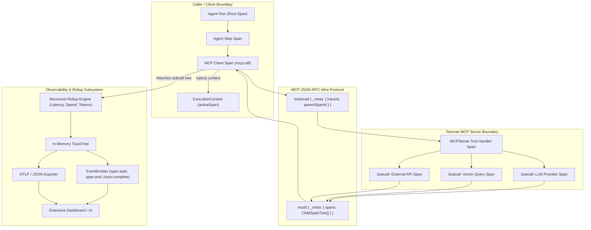

# Hierarchical Spans & MCP Subcall Tracing - Plan

## Goal Capsule

- **Objective:** Enable developers and dashboard operators to inspect, monitor, and visualize every nested subcall occurring beneath high-level agent tools and remote MCP servers through a zero-dependency, hierarchical span tracing system with recursive parent/child rollups.
- **Means:** Ambient `ExecutionContext` span lifecycle (`withSpan`), MCP JSON-RPC `_meta` wire propagation, recursive metric rollups, in-memory `TraceCollector`, and standard OTLP/JSON export formatters.
- **Product Authority:** `ce-brainstorm`
- **Open Blockers:** None

---

## Product Contract

*Product Contract unchanged*

### Summary

A toolkit-wide hierarchical span and tracing subsystem for `@webergency-utils/ai` that captures nested subcalls across Agents, Tools, Storage drivers, and MCP servers. Completed traces form recursive parent/child trees that roll up durations, multi-category spend, and token metrics, with cross-boundary context propagation over MCP JSON-RPC, live event streaming, and OpenTelemetry-compatible (OTLP) JSON export for observability dashboards.

### Problem Frame

While the toolkit tracks flat multi-category spend and model token metrics, production AI workflows frequently execute multi-layered pipelines where a single tool invocation triggers a cascade of subcalls: an agent invokes an MCP tool, which queries a remote vector database, calls a secondary specialized LLM for summarization, and fetches data from a third-party REST API.

Currently, telemetry is recorded as a flat list of records in `SpendTracker`. Without parent-child span hierarchy and cross-boundary trace propagation, developers cannot determine *which* subcall caused latency spikes, attribute costs to specific sub-operations, or inspect distributed call trees across MCP process boundaries. Observability dashboards require a structured tree of spans—analogous to OpenTelemetry—to visualize execution waterfalls, identify bottlenecks, and display recursive cost breakdowns.

### Key Decisions

- **Toolkit-wide hierarchical span system over MCP-only tracking** (session-settled: user-directed — chosen over MCP-focused span tracking: unifies Agent execution steps, local tool calls, storage queries, and remote MCP operations into a single parent/child tree). Governs R1, R2, R3, R4.
- **In-Memory Trace Tree + Real-time Events + JSON/OTLP Exporter over storage driver persistence or pure stream** (session-settled: user-directed — chosen over doc store persistence and pure stream: provides fast in-memory querying, live dashboard event streaming, and zero-dependency standard OTLP export). Governs R11, R12, R13, R14.
- **Scoped withSpan closure alongside manual startSpan/end** (session-settled: user-directed — chosen over auto-instrumentation only: provides ergonomic automatic timing, error capture, and stack scoping for tool authors while preserving manual lifecycle control). Governs R5, R6, R7.
- **MCP _meta wire propagation over bespoke RPC protocol extensions** (session-settled: user-directed — chosen over custom JSON-RPC methods: adheres to standard MCP protocol extensions and preserves full interop with third-party MCP servers). Governs R8, R9, R10.

### Visualizations



### Requirements

#### Span Data Contracts & Trace Model

- R1. The system must support a standard `Span` interface representing an individual timed execution unit with stable attributes: `id`, `traceId`, `parentSpanId`, `name`, `kind` (`'agent'` | `'model'` | `'tool'` | `'storage'` | `'mcp'` | `'custom'`), `startTime`, `endTime`, `durationMs`, `status` (`'ok'` | `'error'`), `errorDetails`, `attributes`, `metrics`, `spendUSD`, `categorySpend`, and `children`.
- R2. Every trace must possess a unique `traceId`, an optional `threadId` and `agentId`, and a root span that serves as the ancestor for all nested operations.
- R3. Spans must support recording arbitrary string/number/boolean key-value metadata attributes (`span.setAttribute(key, value)` and `span.setAttributes(map)`).
- R4. Spans must record domain-specific metrics when available, including token usage (`promptTokens`, `completionTokens`, `cachedTokens`, `reasoningTokens`), data transfer (`bytes`), and execution counts.

#### Ambient Context & Span Lifecycle API

- R5. `ExecutionContext` must provide a scoped `withSpan<T>(name: string, fn: (span: Span) => Promise<T>, options?: SpanOptions): Promise<T>` method that automatically creates a child span under the current active span, records duration, captures unhandled exceptions into span error status, and cleans up the active scope on completion.
- R6. `ExecutionContext` must support explicit manual span management via `startSpan(name: string, options?: SpanOptions): Span` and `span.end(): void`.
- R7. `ExecutionContext` must maintain an internal active span stack or pointer so that nested calls without explicit parent IDs automatically attach as children of the currently active span.

#### Cross-Boundary MCP Propagation

- R8. `MCPClient.callTool` must inject active trace propagation context (`traceId`, `parentSpanId`, optional metadata) into the JSON-RPC request payload under `params._meta`.
- R9. `MCPServer` must inspect incoming request `params._meta` and, when present, initialize the tool handler's `ExecutionContext` to execute as a child of the client's span.
- R10. `MCPServer` must serialize all subcall child spans executed during tool handling and return them in the response under `result._meta.spans`, enabling `MCPClient` to deserialize and graft them under the caller's MCP tool span.

#### Recursive Aggregation & Totals Rollup

- R11. Parent spans must recursively aggregate totals across their entire descendant subtree: total cumulative duration, total spend in USD, per-category spend breakdown (`model`, `storage`, `compute`, `network`, `mcp`, `tools`, `custom`), token metrics, and subcall counts.
- R12. The rollup engine must differentiate between local self-spend/self-duration and rolled-up total spend/total duration for every node in the trace tree.

#### Trace Collection, Real-Time Events & Exporters

- R13. The system must provide an in-memory `TraceCollector` that receives span lifecycle events, stores completed `Trace` trees, limits retention via configurable capacity (LRU), and exposes query methods (`getTrace(traceId)`, `listTraces(options)`).
- R14. `TraceCollector` must emit real-time lifecycle events (`span:start`, `span:end`, `trace:complete`) allowing dashboards to stream active traces over WebSockets or Server-Sent Events.
- R15. The system must provide export formatters that transform internal trace trees into standard formats: pure JSON (`exportTraceToJSON`) and OpenTelemetry-compliant OTLP JSON (`exportTraceToOTLP`) without requiring `@opentelemetry` runtime dependencies.

### Key Flows

- F1. End-to-end agent execution with remote MCP subcall hierarchy
  - **Trigger:** An agent executes a user prompt requiring an MCP tool that calls a remote database and secondary LLM.
  - **Actors:** Agent, `ExecutionContext`, `MCPClient`, `MCPServer`, `TraceCollector`.
  - **Steps:** Agent starts root trace and step span; `MCPClient.callTool` starts child span `mcp:call:fetch_intel` and sends `_meta: { traceId, parentSpanId }`; `MCPServer` receives request, starts handler span, and executes subcalls (vector search span and LLM generation span); server completes, embeds subcall spans in `result._meta.spans`; client grafts subcalls into parent span; agent completes root span; trace collector computes recursive rollups.
  - **Outcome:** The trace tree contains the complete multi-layer waterfall from agent to remote subcalls, with rolled-up duration, costs, and token counts.
  - **Covers R1, R2, R5, R8, R9, R10, R11, R12, R13.**

- F2. Real-time event streaming to live dashboard
  - **Trigger:** A monitoring dashboard connects to `TraceCollector` event listeners.
  - **Actors:** Dashboard client, `TraceCollector`.
  - **Steps:** Dashboard subscribes to `collector.on('span:start')` and `collector.on('span:end')`; operations execute; spans dispatch start and end payloads containing current timing and attributes; dashboard updates waterfall visualization in real-time.
  - **Outcome:** Dashboard renders live execution progress without waiting for the full trace to terminate.
  - **Covers R13, R14.**

- F3. Exporting trace trees to OpenTelemetry-compatible backends
  - **Trigger:** An application exports completed traces to Jaeger, Grafana Tempo, or SigNoz.
  - **Actors:** Application, `exportTraceToOTLP`.
  - **Steps:** Application retrieves completed trace from `collector.getTrace(traceId)`; passes trace to `exportTraceToOTLP(trace)`; formatter maps `Span` nodes into standard OTLP ResourceSpans/ScopeSpans with ISO-8601 timestamps and nanosecond Unix epoch times; application sends JSON payload to standard OTLP HTTP endpoint.
  - **Outcome:** Trace appears seamlessly in Grafana Tempo / Jaeger with zero external npm dependencies required in the toolkit.
  - **Covers R1, R4, R15.**

### Acceptance Examples

- AE1. Nested subcall rollup verification
  - **Covers R1, R11, R12.**
  - **Given:** A parent span `tool:analyze_doc` that executes 2 subcalls: a vector search ($0.0001, 15ms) and an LLM summary ($0.003, 120ms).
  - **When:** Both child spans end and the parent span ends.
  - **Then:** Parent span `totalSpendUSD` is `0.0031`, `categorySpend` has `{ storage: 0.0001, model: 0.003 }`, `subcallCount` is 2, and `durationMs` reflects total elapsed time.

- AE2. Cross-boundary MCP span tree roundtrip
  - **Covers R8, R9, R10.**
  - **Given:** An `MCPClient` connected to an `MCPServer` running an analytics tool that makes an internal database query span.
  - **When:** `client.callTool('analyze', args, { context })` is executed.
  - **Then:** The returned tool result includes `result._meta.spans`, and the client's trace tree contains the server's internal database query span nested under the client's `mcp:call` span with matching `traceId`.

- AE3. OTLP JSON schema compatibility
  - **Covers R15.**
  - **Given:** A completed multi-level trace with root span, tool span, and model span.
  - **When:** `exportTraceToOTLP(trace)` is called.
  - **Then:** The output matches the OpenTelemetry OTLP JSON specification: top-level `resourceSpans`, `scopeSpans`, standard attribute objects with `{ key, value: { stringValue / intValue / doubleValue } }`, and start/end timestamps formatted in nanosecond strings.

### Scope Boundaries

#### Deferred for later

- Streaming transport span chunking (tracking latency per SSE chunk in long-lived streams).
- Automatic database query plan flamegraphs.
- Sampling rate policies (head/tail sampling for high-frequency tracing).

#### Outside this product's identity

- Built-in web dashboard HTTP server or graphical UI (library outputs data and events; external tools consume them).
- Direct runtime dependency on `@opentelemetry/*` packages (exports standard OTLP JSON formats natively).

### Dependencies / Assumptions

- Assumes existing `ExecutionContext` in `src/agent/context.ts` can be extended backwards-compatibly to support `withSpan` and `startSpan`.
- Assumes MCP JSON-RPC protocol specification allows optional `_meta` field in requests and responses.
- Assumes zero external runtime dependencies outside `zod`.

---

## Planning Contract

### Key Technical Decisions

- KTD1. **Standard W3C Trace Context hex IDs** (session-settled: user-approved — chosen over UUIDv4 strings: generates 32-hex `traceId` and 16-hex `spanId` using `node:crypto.randomBytes`, matching W3C Trace Context and OTLP specifications directly without format conversions). Governs R1, R2, R15.
- KTD2. **Isolated child ExecutionContext concurrency in `withSpan`** (session-settled: user-directed — chosen over mutating a single mutable stack on shared context: `ctx.withSpan(name, fn)` creates an isolated child context carrying `activeSpan = childSpan`, preventing race conditions when concurrent `Promise.all` branches execute). Governs R5, R6, R7.
- KTD3. **Recursive post-order tree rollup engine with node caching** (session-settled: user-approved — chosen over continuous incremental updates: aggregates duration, self vs. descendant spend, multi-category breakdowns, and token metrics recursively on trace completion or on query, ensuring correctness even with out-of-order subcall finishes). Governs R11, R12.
- KTD4. **Zero-dependency direct OTLP v1 Protobuf-JSON formatter** (session-settled: user-directed — chosen over bundling `@opentelemetry/sdk-trace-base`: formats traces directly to standard OTLP HTTP/JSON specification with typed attributes and Unix epoch nanoseconds). Governs R15.

### Technical Design

```
+-----------------------------------------------------------------------------------------+
|                                    TraceCollector                                       |
|  - stores completed Traces (LRU capacity)                                               |
|  - emits 'span:start', 'span:end', 'trace:complete'                                     |
+-----------------------------------------------------------------------------------------+
                                          ^
                                          | registers spans & traces
+-----------------------------------------+-----------------------------------------------+
| ExecutionContext (withSpan / startSpan)                                                 |
|  - tracks activeSpan                                                                    |
|  - auto-routes reportSpend to activeSpan                                                |
|                                                                                         |
|  [Agent Run Span: kind='agent']                                                         |
|     +-- [Agent Step Span: kind='agent']                                                 |
|            +-- [Model Gen Span: kind='model']                                           |
|            +-- [MCP Call Span: kind='mcp']                                              |
|                   | (crosses wire via JSON-RPC _meta)                                   |
|                   +-- [Server Tool Span: kind='tool']                                   |
|                          +-- [Storage Query Span: kind='storage']                       |
|                          +-- [Sub LLM Span: kind='model']                               |
+-----------------------------------------------------------------------------------------+
                                          |
                                          v
                         +---------------------------------+
                         |      Recursive Rollup Engine    |
                         |  - selfSpend vs totalSpendUSD   |
                         |  - categorySpend breakdown      |
                         |  - subcallCount & token metrics |
                         +---------------------------------+
                                          |
                        +-----------------+-----------------+
                        |                                   |
                        v                                   v
             [exportTraceToJSON]                   [exportTraceToOTLP]
```

### Assumptions

- Node.js 18+ provides native `node:crypto.randomBytes` for ID generation.
- Spans completed within an `ExecutionContext` automatically associate spend reported via `reportSpend` during their lifespan.

### Implementation Constraints

- Strict Radixxko formatting: Allman braces, padded parentheses `( ... )`, strict semicolons, 4 spaces indentation, colon-aligned object properties.
- Zero runtime dependencies beyond `zod`.

### Sequencing

- Sequence: Contracts & IDs (U1) -> Span lifecycle & Context (U2) -> Rollup Engine (U3) -> MCP Wire (U4) -> Collector & Events (U5) -> Exporters (U6) -> Auto-Instrumentation & E2E (U7).

---

## Implementation Units

### U1. Span, Trace, and Rollup Data Contracts
- **Goal:** Define all TypeScript interfaces, types, and W3C-compliant ID generation functions for the hierarchical span and tracing subsystem.
- **Requirements:** R1, R2, R3, R4.
- **Dependencies:** None.
- **Files:**
  - `src/trace/types.ts`
  - `src/trace/id.ts`
  - `src/trace/index.ts`
  - `tests/trace/types.test.ts`
- **Approach:**
  1. Define `SpanKind` (`'agent' | 'model' | 'tool' | 'storage' | 'mcp' | 'custom'`).
  2. Define `SpanStatus` (`'ok' | 'error'`).
  3. Define `SpanMetrics` for tokens (`promptTokens`, `completionTokens`, `cachedTokens`, `reasoningTokens`), `bytes`, `records`, and arbitrary numeric counts.
  4. Define `SpanRollup` structure carrying `totalDurationMs`, `totalSpendUSD`, `categorySpend`, `metrics`, and `subcallCount`.
  5. Define `Span` interface carrying all properties per R1.
  6. Define `Trace` interface carrying `traceId`, `threadId`, `agentId`, `startTime`, `endTime`, `durationMs`, `rootSpan`, `totalSpendUSD`, and `categorySpend`.
  7. Implement `generateTraceId()` (16 bytes = 32 hex chars) and `generateSpanId()` (8 bytes = 16 hex chars) using `node:crypto`.
- **Patterns to follow:** `src/spend/types.ts` for category and breakdown modeling.
- **Test scenarios:**
  - ID generation produces 32-character hexadecimal lowercase strings for `traceId` and 16-character strings for `spanId`.
  - Sequential ID generation produces unique IDs with zero collisions.
  - Span and Trace type definitions correctly enforce mandatory and optional properties.
- **Verification:** Unit tests in `tests/trace/types.test.ts` pass cleanly.

### U2. Span Implementation & Ambient ExecutionContext
- **Goal:** Implement the runtime `SpanImpl` class and extend `ExecutionContext` with `withSpan`, `startSpan`, and child context isolation.
- **Requirements:** R1, R3, R4, R5, R6, R7.
- **Dependencies:** U1.
- **Files:**
  - `src/trace/span.ts`
  - `src/agent/context.ts`
  - `tests/trace/span.test.ts`
  - `tests/agent/context.test.ts`
- **Approach:**
  1. Implement `SpanImpl` with attribute setters, metric accumulators, self-spend tracking, child management, and `.end(timestamp)`.
  2. Extend `ExecutionContext` interface to declare `traceId`, `activeSpan`, `startSpan`, `withSpan`, and `child`.
  3. In `SimpleExecutionContext`:
     - Store `activeSpan` and parent reference.
     - When `reportSpend(entry)` is invoked, add cost and units directly to `this.activeSpan` in addition to global tracker.
     - In `withSpan(name, fn, options)`: create child span attached to current `activeSpan`, create child context, execute `fn(span, childCtx)` inside `try/catch`. If error thrown, record error details on span, end span, rethrow. If success, end span, return result.
- **Patterns to follow:** `SimpleExecutionContext` in `src/agent/context.ts`.
- **Test scenarios:**
  - `SpanImpl` records attributes, metrics, and spend, and accurately computes `durationMs` on `end()`.
  - `withSpan` automatically manages start/end lifecycle and sets parent-child relationships for nested closures.
  - `withSpan` catches exceptions, records status `'error'` and error details on span, and re-throws the error.
  - Concurrent `Promise.all([ ctx.withSpan(...), ctx.withSpan(...) ])` runs with isolated child contexts without clobbering active span.
- **Verification:** Unit tests in `tests/trace/span.test.ts` and `tests/agent/context.test.ts` pass cleanly.

### U3. Recursive Rollup Engine
- **Goal:** Build the recursive rollup calculation engine that aggregates duration, self vs descendant spend, per-category breakdown, token metrics, and subcall counts across arbitrary span trees.
- **Requirements:** R11, R12.
- **Dependencies:** U1, U2.
- **Files:**
  - `src/trace/rollup.ts`
  - `tests/trace/rollup.test.ts`
- **Approach:**
  1. Implement `computeSpanRollup(span: Span): SpanRollup` performing post-order traversal:
     - Initialize totals with `span.spendUSD`, `span.categorySpend`, and `span.metrics`.
     - Recursively call `computeSpanRollup` on each child in `span.children`.
     - Sum child total spend, category spend, token metrics, and increment subcall count (`subcallCount = sum(child.subcallCount + 1)`).
     - Calculate cumulative duration and wall-clock span duration.
     - Attach rollup to `span.rollup`.
  2. Implement `computeTraceRollup(trace: Trace): Trace` computing root span rollup and updating trace summary fields.
- **Patterns to follow:** `SpendTracker` category breakdown aggregation in `src/spend/tracker.ts`.
- **Test scenarios:**
  - Single leaf span rollup matches self-spend and self-duration with `subcallCount: 0`.
  - Multi-level nested tree aggregates total spend and per-category breakdown accurately (Covers AE1).
  - Deep trees with branches correctly distinguish between a parent's self-spend and cumulative rolled-up spend.
- **Verification:** Unit tests in `tests/trace/rollup.test.ts` pass cleanly.

### U4. Cross-Boundary MCP Wire Propagation
- **Goal:** Implement MCP `_meta` context injection in `MCPClient` and context extraction / subcall serialization in `MCPServer`.
- **Requirements:** R8, R9, R10.
- **Dependencies:** U1, U2, U3.
- **Files:**
  - `src/mcp/types.ts`
  - `src/mcp/client.ts`
  - `src/mcp/server.ts`
  - `tests/mcp/tracing.test.ts`
- **Approach:**
  1. Extend `JSONRPCRequest.params` with optional `_meta?: { traceId?: string, parentSpanId?: string, metadata?: Record<string, unknown> }`.
  2. Extend `MCPToolResult` with optional `_meta?: { spans?: SerializedSpan[] }`.
  3. In `MCPClient.callTool`: if `context?.activeSpan` exists, start child span `mcp:call:${name}`, inject `_meta: { traceId, parentSpanId: span.id }` into request params, execute RPC. On response, if `result._meta?.spans` present, deserialize and attach as children of the `mcp:call` span, end span.
  4. In `MCPServer.handleMessage`: when handling `tools/call`, check `params._meta`. If present, instantiate server `ExecutionContext` with root pointing to `parentSpanId` and `traceId`. Pass context to tool handler. Collect completed child spans and serialize them into `result._meta.spans`.
- **Patterns to follow:** `InMemoryTransport` RPC round-trip in `tests/mcp/client-server.test.ts`.
- **Test scenarios:**
  - `MCPClient` sends `_meta` in tool call request params when context has active span.
  - `MCPServer` handles tool call with `_meta`, executes subcalls, and embeds serialized spans in `result._meta.spans` (Covers AE2).
  - Client grafts server subcall tree under `mcp:call` span.
  - Backward compatibility: client talking to server without `_meta` executes normally without error.
- **Verification:** Tests in `tests/mcp/tracing.test.ts` pass cleanly.

### U5. In-Memory TraceCollector & Real-Time Event Bus
- **Goal:** Implement the `TraceCollector` to manage active traces, store completed trace trees in an LRU cache, and emit real-time lifecycle events.
- **Requirements:** R13, R14.
- **Dependencies:** U1, U2, U3.
- **Files:**
  - `src/trace/collector.ts`
  - `tests/trace/collector.test.ts`
- **Approach:**
  1. Implement `TraceCollector` with typed event emitter:
     - Events: `'span:start'`, `'span:end'`, `'trace:complete'`.
  2. Implement LRU storage for completed traces with configurable `maxTraces` (default 1000).
  3. Methods:
     - `startTrace(options?: StartTraceOptions): { trace: Trace, rootSpan: Span, context: ExecutionContext }`.
     - `recordSpan(span: Span): void`.
     - `endTrace(traceId: string): Trace`.
     - `getTrace(traceId: string): Trace | undefined`.
     - `listTraces(filter?: TraceFilterOptions): Trace[]`.
- **Patterns to follow:** `SpendTracker` in-memory querying in `src/spend/tracker.ts`.
- **Test scenarios:**
  - Collector emits `'span:start'` when span starts and `'span:end'` when span ends (Covers F2).
  - Completed traces are stored and retrievable via `getTrace(traceId)`.
  - LRU eviction purges oldest traces when capacity limit is reached.
  - Query filtering by status, threadId, agentId, and duration works correctly.
- **Verification:** Unit tests in `tests/trace/collector.test.ts` pass cleanly.

### U6. JSON and OpenTelemetry (OTLP) Exporters
- **Goal:** Implement standard JSON and OTLP v1 Protobuf-JSON schema exporters without external runtime dependencies.
- **Requirements:** R15.
- **Dependencies:** U1, U2, U3.
- **Files:**
  - `src/trace/exporter.ts`
  - `tests/trace/exporter.test.ts`
- **Approach:**
  1. Implement `exportTraceToJSON(trace: Trace, options?: { pretty?: boolean }): string`.
  2. Implement `exportTraceToOTLP(trace: Trace, options?: OTLPExportOptions): OTLPExportTraceServiceRequest`:
     - Flatten tree into array of span descriptors with `parentSpanId`.
     - Map `startTime` and `endTime` to Unix nanosecond strings (`BigInt(startTime) * 1_000_000n`).
     - Map `SpanKind` to numeric OTLP enum (INTERNAL=1, SERVER=2, CLIENT=3).
     - Map attributes to typed OTLP format (`{ key, value: { stringValue / intValue / doubleValue / boolValue } }`).
     - Map status code (`1` for OK, `2` for ERROR).
- **Patterns to follow:** Standard OpenTelemetry OTLP JSON trace specification.
- **Test scenarios:**
  - `exportTraceToJSON` outputs full hierarchical tree with rollup data.
  - `exportTraceToOTLP` produces valid OTLP JSON structure with `resourceSpans`, `scopeSpans`, Unix nanosecond timestamps, and typed attributes (Covers AE3, F3).
- **Verification:** Unit tests in `tests/trace/exporter.test.ts` pass cleanly.

### U7. Agent & Storage Auto-Instrumentation Wiring and E2E Dashboard Flow
- **Goal:** Wire tracing into `Agent` and `MemoryDocStore`, export public trace APIs, and verify end-to-end multi-layer execution waterfall.
- **Requirements:** R1, R2, R5, R8, R9, R10, R11, R12, R13, R14, R15.
- **Dependencies:** U1, U2, U3, U4, U5, U6.
- **Files:**
  - `src/agent/agent.ts`
  - `src/storage/document.ts`
  - `src/index.ts`
  - `tests/trace/e2e-dashboard.test.ts`
- **Approach:**
  1. In `Agent.run`: if `options.context` or config has trace support, wrap run in `agent:run` span, steps in `agent:step` spans, model generation in `model:generate` spans, tool calls in `tool:run` spans.
  2. In `MemoryDocStore`: wrap `get`, `set`, `delete`, `list` in `storage:doc:${op}` spans if context supports `withSpan`.
  3. Export all tracing types, classes, and helper functions in `src/index.ts`.
  4. Write comprehensive E2E test verifying Flow F1, F2, F3.
- **Patterns to follow:** `tests/agent/agent.test.ts` and `tests/mcp/client-server.test.ts`.
- **Test scenarios:**
  - End-to-end agent execution with MCP tool calling subcalls produces complete nested waterfall (Covers F1).
  - Real-time event subscription captures live execution sequence (Covers F2).
  - Complete trace exported to OTLP JSON (Covers F3).
- **Verification:** All tests in `tests/trace/e2e-dashboard.test.ts` pass cleanly; `npm test` and `npm run build` succeed with zero errors.

---

## Verification Contract

### Test Commands
- Run individual unit tests during implementation:
  - `npx vitest run tests/trace/types.test.ts`
  - `npx vitest run tests/trace/span.test.ts tests/agent/context.test.ts`
  - `npx vitest run tests/trace/rollup.test.ts`
  - `npx vitest run tests/mcp/tracing.test.ts`
  - `npx vitest run tests/trace/collector.test.ts`
  - `npx vitest run tests/trace/exporter.test.ts`
  - `npx vitest run tests/trace/e2e-dashboard.test.ts`
- Full test suite:
  - `npm test`
- Build check:
  - `npm run build`

### Quality Gates
- 100% test pass rate across all existing (25 test files) and new test files.
- Zero TypeScript compilation errors (`tsc --noEmit` / `npm run build`).
- Strict Radixxko formatting compliance: 4 spaces indentation, Allman braces, padded parens, semicolons.

---

## Definition of Done

### Global Criteria
- All 15 requirements (R1 through R15) and 3 key flows (F1 through F3) are verified with passing automated tests.
- All 3 acceptance examples (AE1, AE2, AE3) pass explicitly.
- Zero external runtime dependencies added outside `zod`.
- Full backward compatibility preserved for existing `SpendTracker`, `ExecutionContext`, `MCPClient`, `MCPServer`, and `Agent` consumers.

### Per-Unit Criteria
- Each unit (U1 to U7) has dedicated unit test coverage.
- Code builds cleanly into `dist/`.

### Cleanup Criteria
- No abandoned prototype or temporary scratch code remaining in `src/` or `tests/`.

