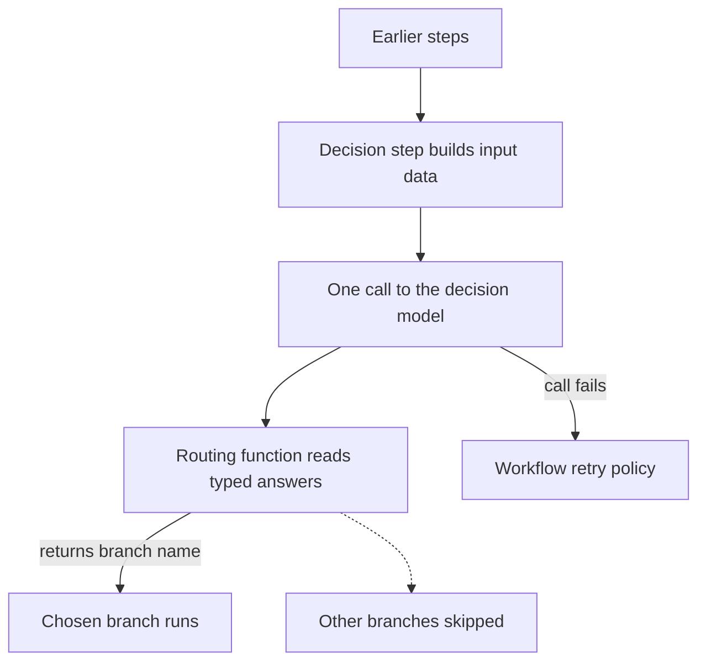

# Decision Models and Jev - Plan

## Goal Capsule

- **Objective**: Code built on `@webergency-utils/ai` can ask a model to pick a label, place something on a scale, or answer yes or no, and get back typed answers with probabilities. One contract serves TypeSafe's Jev and any language model, and a workflow can choose its next branch from the answers.
- **Product Authority**: Area 3 of 8 from the 2026-10-04 library assessment. The other seven areas are context and are not active scope.
- **Open Blockers**: None for planning. Implementation follows the reliability pass and model-layer parity, which supply branch skipping and structured output.

---

## Product Contract

### Summary

Add a second model class, decision models, beside language models.
A decision model takes input data plus named, typed questions and returns one typed answer per question, with probabilities.
Jev is the native implementation, and any language model with structured output can stand in for it.
A workflow decision step asks its questions in one call, and a typed routing function picks the next branch.

### Problem Frame

The library has one model contract, and it is shaped around chat: messages in, text or tool calls out.
Today a decision such as classifying a ticket, routing a request, scoring a lead or gating an action means prompting a language model and parsing its reply by hand.
The library has no structured output yet (the toolkit plan's R1 is unmet), so nothing types the result or reports how sure the model was.

TypeSafe AI released Jev on 2026-09-15 as the first of a new class it calls System One models.
Jev takes input data and typed questions and returns typed answers with calibrated probabilities in 70 to 500 ms.
Input costs $0.042 per million tokens and output is free.
It has no messages, no text output and no streaming, so the chat contract cannot describe it.

Jev is three weeks old, in early access, and from a single vendor.
A contract that only Jev can satisfy would tie decision code to one company.
TypeSafe itself ships a wrapper that makes ordinary language models answer the same question types, which shows the shape works for both.

### Key Decisions

- **Two model classes: language models and decision models.** Jev has no messages, text output or streaming, so the chat contract cannot describe it (session-settled: user-directed — chosen over registering Jev as one more chat provider). Governs R1, R3.
- **The chat model class is named `LanguageModel`** (session-settled: user-approved — chosen over `LLModel`: same meaning, reads more cleanly, and matches the name Vercel AI SDK users know). Governs R3.
- **Jev natively, plus an adapter for any language model.** Decision code doesn't depend on one early-access vendor (session-settled: user-directed — chosen over Jev only and over language models first). Governs R9, R11.
- **One answer shape for both kinds of model, with language-model answers marked uncalibrated.** Code can swap models without changes and still tell calibrated probabilities from self-reported ones (session-settled: user-directed — chosen over answers that carry only the value and over estimating probabilities from token log-probabilities). Governs R6, R7, R11.
- **Question types use the library's own names.** The contract stays vendor-neutral (session-settled: user-approved — chosen over Jev's names, such as `noul` for yes/no). Governs R4, R8.
- **The workflow decision step is the only integration in this version** (session-settled: user-directed — chosen over agent guardrails, confidence-based escalation, batch decisions and decisions exposed as tools, which are all deferred). Governs R16.
- **A typed routing function picks the branch** (session-settled: user-directed — chosen over a declarative mapping from answer values to branches, and over offering both). Governs R17, R18.
- **No automatic failover between decision models.** A failed decision call goes to the caller and the workflow's retry policy (session-settled: user-directed — chosen over falling back to another model on error). Governs R20.
- **The Jev adapter does not require TypeSafe's SDK.** This follows the toolkit plan's rule that providers use native HTTP and vendor SDKs stay optional. Governs R9.

### Requirements

**Decision contract**

- R1. The library offers a decision-model contract: the caller sends input data and a set of named questions in one call, and gets back one answer per question name.
- R2. Input data may be text, a structured object or a list.
- R3. The existing chat contract becomes the language-model class, named `LanguageModel`.
- R4. Three question types are supported, and every question can carry instructions.
  - **Choice:** one label from a named set of up to 255 labels, each optionally described.
  - **Score:** a position on an ordered scale of 2 to 10 described levels.
  - **Yes/no:** the probability that the answer is yes, with optional descriptions of what yes and no mean.
- R5. Answer types are inferred at compile time from the questions passed. A choice answer's value is the union of that question's labels, and score and yes/no answers are numbers.
- R6. A choice or score answer carries a probability for each label or level and a confidence value. A yes/no answer carries its probability.
- R7. Every decision response states whether its probabilities are calibrated. Jev's responses are calibrated, and language-model responses are not.
- R8. Translation from the library's question names to a vendor's wire format, such as Jev's `noul`, happens inside that vendor's adapter.

**Implementations**

- R9. A native Jev adapter calls TypeSafe's official API over HTTP, without requiring TypeSafe's SDK.
- R10. The Jev adapter reads its key from `TYPESAFE_API_KEY` when none is given, and accepts either a pinned model version or `jev-latest`.
- R11. A language-model adapter lets any `LanguageModel` that supports structured output answer the same questions. Its answers have the shape in R6, with self-reported probabilities marked uncalibrated per R7.
- R12. A decision request to a language model without structured-output support fails with an error that names the missing capability.
- R13. Decision calls accept cancellation and timeouts, and retry the same way language-model calls do (reliability pass R6 and R7).
- R14. Decision calls report spend and appear in traces the same way language-model calls do. Jev is priced on input tokens only, since its output is free.
- R15. A request larger than the decision model's input limit fails with an explicit error; the library never truncates input to make it fit.

**Workflow decision step**

- R16. A workflow can include a decision step that sends one or more questions about its input in a single decision-model call.
- R17. The decision step's routing function receives the typed answers and returns the name of the next branch. Only that branch runs (reliability pass R19).
- R18. A routing function can route only to declared branches. A branch name that was not declared is rejected.
- R19. The decision step's answers become its step output and are saved in the workflow checkpoint, and a resumed run does not request them again.
- R20. When the decision call fails, the decision step fails like any other step and follows the workflow's retry policy. No other model is tried.

### Key Flows

- F1. Routing a workflow on a decision
  - **Trigger:** a workflow run reaches a decision step.
  - **Steps:**
    1. The step builds its input data from the outputs of earlier steps.
    2. It sends its questions to the configured decision model in one call.
    3. The routing function receives the typed answers and returns a branch name.
    4. The runner runs that branch and skips the others.
    5. The answers are saved in the workflow checkpoint as the step's output.
  - **Outcome:** exactly one branch runs, and the decision can be inspected after the run.
  - **Covered by:** R16, R17, R18, R19.

- F2. Swapping Jev for a language model
  - **Trigger:** a developer configures a language model as the decision model, for example while waiting for Jev access.
  - **Steps:**
    1. The developer changes the decision model in configuration.
    2. Questions, routing functions and answer-handling code stay the same.
  - **Outcome:** answers keep the same shape and are marked uncalibrated.
  - **Covered by:** R7, R11.

### Acceptance Examples

- AE1. Misspelled label
  - **Covers R5.**
  - **Given:** a choice question with the labels `billing`, `technical` and `other`.
  - **When:** code compares the answer's value to `"bililng"`.
  - **Then:** the code fails to compile.
- AE2. Same questions, two models
  - **Covers R6, R7, R11.**
  - **Given:** the same questions sent to Jev and to a language model with structured output.
  - **When:** both respond.
  - **Then:** both responses have the same shape. Jev's is marked calibrated and the language model's is marked uncalibrated.
- AE3. Language model without structured output
  - **Covers R12.**
  - **Given:** a language model without structured-output support, configured as a decision model.
  - **When:** a decision is requested.
  - **Then:** the call fails with an error that names the missing capability.
- AE4. Routing to declared branches only
  - **Covers R17, R18.**
  - **Given:** a decision step whose routing function sends `billing` to branch A and `technical` to branch B.
  - **When:** the answer is `billing`.
  - **Then:** A runs and B is skipped.
  - **Given:** a routing function that returns `refund`, which is not a declared branch.
  - **Then:** that branch name is rejected.
- AE5. Resume after a decision
  - **Covers R19.**
  - **Given:** a run that passed a decision step and then suspended at a wait step.
  - **When:** the run resumes.
  - **Then:** the decision model is not called again, and the saved answers still drive routing.
- AE6. Jev keeps failing
  - **Covers R20.**
  - **Given:** Jev returns a server error on every attempt, and the decision step allows 2 retries.
  - **When:** the step runs.
  - **Then:** the step fails after 3 attempts and no language model is called.

### Success Criteria

- A workflow switches between Jev and a language model with a configuration change only; question definitions and routing code are untouched.
- A misspelled label or branch name is caught by the compiler or rejected at runtime, never silently treated as no match.

### Scope Boundaries

**Deferred for later**

- Agent guardrails built on yes/no decisions.
- Escalating to another model or a human when confidence is low.
- Batch decisions over many records.
- Decisions exposed as tools to agents or MCP clients.
- Automatic failover between decision models.
- Probabilities estimated from a language model's token log-probabilities.
- TypeSafe API endpoints other than the decision call, such as model listing.

<!-- ce-section: work-relationships -->
### How This Work Fits Together

This plan covers area 3, decision models and Jev, of eight areas from the 2026-10-04 library assessment.
The breakdown below is the current understanding, not a committed roadmap.

- Reliability pass, in `docs/plans/2026-10-05-1153-fix-reliability-pass-plan.md`
  - Enables this plan through branch skipping (its R19) and cancellation, timeouts and retries (its R6 and R7).
- Model-layer parity
  - Enables this plan's language-model adapter (R11) through structured output on every provider.
- Agent capabilities
  - Can proceed independently of this plan.
  - Still to decide: whether agent guardrails build on yes/no decisions from this plan.

### Dependencies / Assumptions

- The package has never been published, so renaming the chat contract to `LanguageModel` breaks no external caller.
- The owner has no production workload on Jev yet. The API shape comes from TypeSafe's announcement and SDK documentation, not from observed traffic.
- Jev is in early access with a waitlist. Testing the native adapter against the real API needs a TypeSafe key.
- Jev's input limits (about 64k tokens for input data plus all questions, and 32k for input data plus the longest question) come from third-party documentation and need confirming against TypeSafe's official docs.
- Only TypeSafe's official API at `api.typesafe.ai` is a supported target. `jevtypesafeai.com` is a third-party reseller gateway with a different API.

### Outstanding Questions

**Deferred to Planning**

- Whether the Jev adapter offers the official `@typesafe-ai/sdk` as an optional bridge, like the existing SDK bridge for other providers (R9).
- How a language model is prompted to produce per-label probabilities and a confidence value (R11).
- How a decision step declares its branches so that R18 is checked at compile time where possible.

### Sources / Research

- TypeSafe announcement of System One models and Jev, 2026-09-15: https://typesafe.ai/blog/introducing-system-one-models-and-jev
- Third-party reference for `@typesafe-ai/sdk` 0.6.0, covering question builders, typed answers and retry behavior: https://jevwiki.ai/wiki/reference/javascript-sdk.md
- The chat-shaped contract this plan renames: `src/core/protocol.ts`
- The request type, which has no structured-output field: `src/core/types.ts:72`
- The condition node that branch routing replaces: `src/workflow/runner.ts:183`
- Native HTTP by default with optional vendor SDKs: `docs/plans/2026-09-18-1757-feat-ai-toolkit-plan.md`
