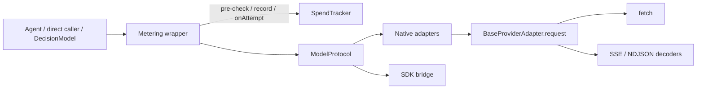
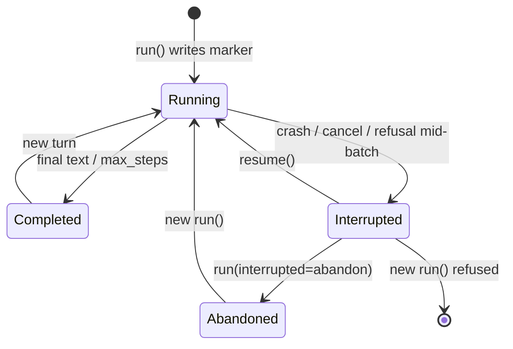
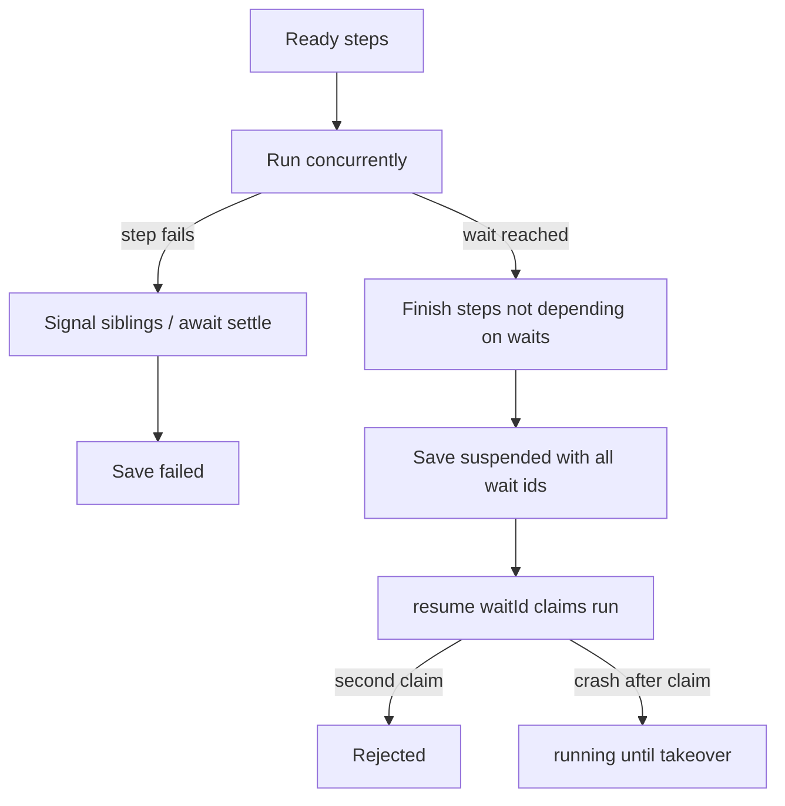

# Reliability Pass - Plan

## Goal Capsule

- **Objective**: Services built on `@webergency-utils/ai` get either a correct result or an explicit error from every model call, agent run, workflow run, spend record, storage operation and trace. They never get a plausible wrong answer, a silent $0 or a call that hangs.
- **Means**: Shared provider transport and metering wrapper, rebuilt pricing, agent run markers, workflow concurrency contract, repaired fuzz harness (KTD1–KTD8).
- **Product Authority**: Area 1 of 8 from the 2026-10-04 library assessment. The other seven areas are context and are not active scope.
- **Open Blockers**: None.
- **Execution profile**: Test-first on every defect unit. Characterization coverage before changing parsers, spend calculator, agent loop and workflow runner.

---

## Product Contract

### Summary

Fix every verified defect where the library returns wrong results or hangs, and adopt one rule across the codebase: when something cannot be computed, report it instead of substituting a default.
Model calls gain cancellation, timeouts and retries through one shared transport.
Spend and budget checks go through one metering wrapper.
The stream parsers are tested at every chunk boundary, and the fuzz harness is repaired so CI actually fuzzes them.

Product Contract preservation: restructured, no silent scope change — R25, R31 and R32 clarified per confirmed plan-time synthesis; R44–R59 and AE11–AE16 added from that synthesis and research-found defects the user accepted.

### Problem Frame

The library is meant to run inside the owner's production services and to compete with Vercel AI SDK, Mastra and the official MCP SDK.
All 142 tests pass, and typecheck and lint are clean, but the tests check happy paths against hand-written mocks of each provider's API.

A 2026-10-04 assessment found defects that do not throw.

- **Streaming:** text and tool calls are lost depending on how the network splits a response.
- **Credentials:** a second tenant's model calls go out with the first tenant's API key.
- **Workflows:** both sides of a condition branch run.
- **Agents:** long threads stop answering after 10 steps in total.
- **Spend:** usage is priced at $0 for every model newer than early 2025, so budget caps never trip.

Planning research found more: the fuzz CI job never fuzzed (it installs an unrelated `jazzer` package), truncated streams return as success, the default thread id can collide across concurrent runs, and most built-in prices are retired or wrong.
In production these show up as wrong behavior far from the cause.

### Key Decisions

- **Fail loudly instead of substituting defaults** (session-settled: user-directed — chosen over fixing the listed defects in place and over recording live provider responses first: in production a plausible wrong result is worse than an error). Governs R1, R2, R3, R4, R44, R57.
- **Fuzz the stream parsers at chunk boundaries now; record live provider responses later** (session-settled: user-directed — chosen over building recorded live-provider tests in this pass). Governs R43, R56.
- **Retry by default** (session-settled: user-approved — chosen over opt-in retries). Governs R7, R55.
- **Refuse unpriced model calls when a budget cap is set** (session-settled: user-approved — chosen over a warning only). Governs R31, R48, R50.
- **A step after a branch runs when at least one of its dependencies completed** (session-settled: user-approved — chosen over skipping the shared step too and over rejecting such workflows at build). Governs R19, R20.
- **Run independent workflow steps in parallel in this pass** (session-settled: user-approved — chosen over deferring parallelism). Governs R18, R53, R54.
- **New turn on an interrupted thread is refused until resume or abandon** (session-settled: user-approved — chosen over continuing silently: providers reject histories with unanswered tool calls). Governs R46, R17.
- **Budget refusals apply to model calls only; the crossing-cap call returns** (session-settled: user-approved — chosen over refusing storage/checkpoints and over discarding a paid response). Governs R31, R32, R48, R49.
- **Price matching is stricter and provider-aware** (session-settled: user-approved — chosen over plain longest-prefix matching and model-name-only keys: those still produce plausible wrong prices and would block every Ollama call under a cap). Governs R25, R50, R51, R52.
- **Retry-after hints longer than 60 seconds fail immediately** (session-settled: user-approved — chosen over sleeping for the full hint). Governs R8, R55.
- **Change behavior without deprecation shims.** The package has never been published.
- **One area at a time, reviewed before the next starts** (session-settled: user-directed — chosen over hands-off sequential runs, a Jev-first order and one combined plan).

### Requirements

**Fail-loudly rule**

- R1. No library code path substitutes a default value for a result it could not compute; it reports the gap or raises an error, as R2 to R4 describe.
- R2. A gap in reference data that the caller cannot fix at call time, such as usage for a model with no known price, is recorded as a gap (never as $0) and announced through the library's warning events.
- R3. Programmer and input errors raise an error. Examples are a vector of the wrong dimension, a file path outside a store's root, and a workflow route to a branch that does not exist.
- R4. Reaching a configured limit, such as an agent's step limit, is reported as an explicit status on the result, distinct from normal completion.

**Model calls**

- R5. Streamed responses deliver every event however the network splits the bytes, for both SSE and newline-delimited JSON. This includes a final event or line that has no trailing terminator.
- R6. Every model call accepts a cancellation signal that aborts the in-flight request, and applies a request timeout with a library default the caller can override.
- R7. Model calls retry rate-limit errors, timeouts and transient server errors with backoff by default, and callers can change the attempt count or turn retries off. Quota and billing 429s are not retried. A response that has already started streaming is never retried.
- R8. Retries and rate-limit errors read the provider's retry-after hint in seconds, HTTP-date and `retry-after-ms` forms. A hint longer than 60 seconds fails immediately with the wait in the error (R55).
- R9. Creating a model with different credentials or settings never returns an adapter configured with someone else's credentials or settings.
- R10. System-role messages reach every provider that supports system instructions, including Gemini.
- R11. Streaming preserves every tool call in a chunk, not only the first one, on every provider that streams tool calls.
- R12. The DeepSeek and Mistral providers read their own API-key environment variables, not OpenAI's.
- R13. Tool results sent back to Gemini identify the tool by its name.
- R44. A stream that ends without its terminator, or that carries an in-stream error event, raises an error instead of returning partial text as success.
- R55. A retry-after hint longer than 60 seconds is not slept; the call fails with the wait included in the error.
- R57. Calls through the vendor-SDK bridge that return no usage are recorded as a spend gap per R2, never as free.
- R59. Each retry attempt is visible to spend and tracing before the next attempt starts, so a budget can be re-checked and an abandoned attempt can be recorded as a gap.

**Agent runs**

- R14. An agent's step limit applies per run, not cumulatively across a thread's turns.
- R15. A run that stops at the step limit reports this per R4 instead of returning empty text.
- R16. The agent saves a checkpoint after each model response and after each individual tool call. A crash in the middle of a batch then loses only the call in progress (toolkit plan R15 and AE2).
- R17. Resuming an interrupted run continues from its last checkpoint without re-running completed tool calls and without adding the user's input a second time.
- R45. When the caller omits a thread id, the library assigns one that cannot collide with another concurrent run.
- R46. A new `run()` on a thread whose last run was interrupted is refused until the caller resumes that run or explicitly abandons it.
- R47. Caller abort, budget refusal and cancellation end the run and are not saved as completed tool results. Ordinary tool and argument errors become tool results with an error flag.

**Workflow runs**

- R18. Steps whose dependencies are satisfied run concurrently.
- R19. A branch decision runs only the chosen branch. A not-chosen branch target is skipped even when it has other completed dependencies. A step whose dependencies were all skipped or not chosen is itself skipped and reported as skipped.
- R20. A step with one declared dependency receives that dependency's raw output. A step with several receives a map of completed dependency outputs keyed by step id. Implicit branch edges order and skip steps but carry no data.
- R21. Step retries wait with backoff between attempts.
- R22. A failed run is saved with its failure, so it can be inspected after a process restart.
- R23. Only one resume of a suspended run proceeds, even when several processes share the checkpoint store; a second concurrent resume is rejected.
- R24. Starting a workflow that contains any wait step without a checkpoint store raises an error before any step runs.
- R53. When a step fails, siblings are signalled to stop, no new steps start, in-flight steps settle, and the run is saved once as failed with the first error. When waits are reached, every step that does not depend on a pending wait keeps running, then the run suspends with every wait reached. Failed beats suspended.
- R54. Resume names the wait being signalled. A resume that claims a run and then crashes leaves it marked in progress until an explicit takeover; there is no automatic lease.

**Spend**

- R25. A model's price resolves by exact name first, then by a recognized snapshot or date suffix on the longest matching priced name. An unlisted variant is unpriced, not silently matched to a sibling.
- R26. Cached prompt tokens are billed once, at the cache rate, after each provider's usage is normalized.
- R27. Reasoning tokens are billed once. Providers that already count them inside completion tokens are not charged again; Gemini's separate thoughts count is added to output.
- R28. Spend recorded on a trace span matches the cost the spend tracker records, including spend reported as units only.
- R29. Spend reported through an agent's context counts toward that thread's and that agent's totals.
- R30. Spend reported by tools running behind the MCP server reaches the server's spend tracker.
- R31. Usage for a model with no known price is handled per R2 when no model-budget cap is set; when such a cap is set, the model call is refused before it is made.
- R32. Once a model budget is exhausted, further model calls are refused before they are made. The call that crossed the cap returns its result; `record` does not throw after recording.
- R33. The built-in price list covers each supported provider's current models at release, using the providers' published prices.
- R48. Budget and unpriced refusals apply only to model calls. Tool, storage and checkpoint spend is recorded and warned about, never refused.
- R49. The call that crosses a model budget returns its result and fires a budget-exceeded warning; the next model call is refused.
- R50. Pricing is provider-aware. Ollama on its default local address is free. A custom `baseUrl` makes the model unpriced until the caller registers pricing for it.
- R51. Prefix price matching applies only when the remainder is a recognized snapshot or date suffix.
- R52. The pricing model expresses prompt-size tiers, separate Anthropic 5-minute and 1-hour cache-write rates, and effective dates. DeepSeek is priced at its peak rate. Batch, flex, priority and data-residency multipliers are reported as gaps when present.

**Storage**

- R34. A disk file store never reads or writes outside its root, including through symbolic links, and accepts legitimate names that start with two dots.
- R35. A failed streaming write to the disk store surfaces as an error.
- R36. The in-memory cache counts only live entries toward its size limit and evicts expired entries before live ones.
- R37. Vector operations with mismatched dimensions raise an error per R3.

**Tracing and MCP**

- R38. Trace collection keeps a bounded number of in-progress traces and announces any trace it drops, per R2.
- R39. Ending a span a second time does not change its recorded end time or duration.
- R40. MCP client requests time out, with a default the caller can override. On timeout or abort the client sends `notifications/cancelled` except for `initialize`.
- R41. Closing the MCP client rejects any requests still pending.
- R58. When the MCP transport dies on its own, pending requests are rejected the same way as on close.

**Verification**

- R42. Every defect fixed in this pass has a regression test that fails before the fix.
- R43. The SSE and newline-delimited JSON parsers are tested against provider-format responses split at every byte position, and the fuzz harness feeds them randomly split input.
- R56. The fuzz CI job installs and runs `@jazzer.js/core` against those targets. It does not install the unrelated `jazzer` package.

### Acceptance Examples

- AE1. Event split across network reads
  - **Covers R5.**
  - **Given:** an SSE response where one event's `data:` line arrives in one network chunk and its blank terminator arrives in the next.
  - **When:** the response is streamed.
  - **Then:** the event is delivered once, with its full data.
- AE2. Two tenants, one model
  - **Covers R9.**
  - **Given:** two model creations for the same provider and model with different API keys.
  - **When:** each model is called.
  - **Then:** each request carries the key it was created with.
- AE3. Rate limit with an HTTP-date hint
  - **Covers R7, R8.**
  - **Given:** a provider answers 429 with a retry-after hint that is an HTTP date three seconds ahead.
  - **When:** retries are on.
  - **Then:** the call waits about three seconds and retries.
  - **When:** retries are off.
  - **Then:** the rate-limit error surfaces with a wait of 3 seconds.
- AE4. Step limit per run
  - **Covers R14, R15.**
  - **Given:** a thread that has used 9 steps over earlier turns, and a step limit of 10.
  - **When:** the user sends a message whose answer needs 3 steps.
  - **Then:** the run completes normally.
  - **When:** a single run needs 12 steps.
  - **Then:** the result reports that it stopped at the limit.
- AE5. Crash in the middle of a tool batch
  - **Covers R16, R17.**
  - **Given:** a model response with three tool calls, and a process crash during the third call.
  - **When:** the run is resumed.
  - **Then:** tool calls one and two do not run again, and the user's message appears once in the thread.
- AE6. Only the chosen branch runs, and the join still runs
  - **Covers R19, R20.**
  - **Given:** a condition that routes to step A when true and step B when false, and a step D that depends on both A and B.
  - **When:** the condition is true.
  - **Then:** A runs, B is reported as skipped, and D runs with a map containing A's output.
- AE7. Concurrent resume
  - **Covers R23, R54.**
  - **Given:** a run suspended at a wait step, and two processes that share its checkpoint store.
  - **When:** both call resume for that wait at the same time.
  - **Then:** one resume proceeds and the other is rejected.
- AE8. Dated model name
  - **Covers R25, R51.**
  - **Given:** usage recorded for `gpt-4o-mini-2024-07-18`.
  - **When:** spend is calculated.
  - **Then:** it uses the `gpt-4o-mini` price, not the `gpt-4o` price.
  - **Given:** usage for an unlisted sibling such as `o1-pro` when only `o1` is priced.
  - **Then:** the usage is unpriced, not billed at the `o1` rate.
- AE9. Unpriced model
  - **Covers R2, R31, R48, R50.**
  - **Given:** a model with no known price and no model-budget cap.
  - **When:** the model is called.
  - **Then:** the call succeeds, its spend record is marked unpriced, and a warning event fires.
  - **Given:** the same model with a model-budget cap set.
  - **When:** the model is called.
  - **Then:** no request is sent, and an error says the cap cannot be enforced for that model.
  - **Given:** a storage write under the same cap.
  - **Then:** the write proceeds and is recorded, not refused.
- AE10. Exhausted budget
  - **Covers R32, R49.**
  - **Given:** a tracker whose model budget is already used up.
  - **When:** an agent tries another model call.
  - **Then:** no request is sent and a budget error is raised.
- AE11. Interrupted thread
  - **Covers R46, R17.**
  - **Given:** a thread whose last run crashed after a model response with unanswered tool calls.
  - **When:** the caller calls `run()` again.
  - **Then:** the call is refused with an interrupted-run error.
  - **When:** the caller resumes.
  - **Then:** completed tool calls are not re-run and the user input is not duplicated.
- AE12. Crossing the cap
  - **Covers R49.**
  - **Given:** a tracker one dollar below its model cap, and a call that costs two dollars.
  - **When:** the call completes.
  - **Then:** the caller gets the response, a budget-exceeded warning fires, and the next model call is refused.
- AE13. Parallel step failure
  - **Covers R53.**
  - **Given:** two independent steps A and B running, and A fails.
  - **When:** the runner settles.
  - **Then:** B is signalled to stop, nothing new starts, and the run is saved as failed with A's error.
- AE14. Truncated stream
  - **Covers R44.**
  - **Given:** an OpenAI stream that closes without `[DONE]`.
  - **When:** the response is consumed.
  - **Then:** an error is raised; partial text is not returned as success.
- AE15. Long retry-after
  - **Covers R55.**
  - **Given:** a 429 with `retry-after: 120`.
  - **When:** the call is made with retries on.
  - **Then:** the call fails immediately with a wait of 120 seconds; it does not sleep for two minutes.
- AE16. Concurrent default threads
  - **Covers R45.**
  - **Given:** two agent runs started in the same millisecond without a thread id.
  - **When:** both complete a turn.
  - **Then:** each has a distinct thread id and neither can load the other's history.

### Success Criteria

- Each correctness defect from the 2026-10-04 assessment that falls in this pass's areas traces to a requirement here and to a regression test (R42).
- The fuzz CI job exercises the stream parsers with `@jazzer.js/core` (R56).
- A service can enforce a model budget without refusing local Ollama calls or checkpoint writes (R48, R50).

### Scope Boundaries

These belong to later areas, not this plan:

- Model-layer parity: structured output, assembling streamed tool calls, embeddings, reasoning content, prompt-cache controls, typed tool arguments and multimodal mapping.
- Agent capabilities: agent streaming, parallel tool calls, guardrails, structured final output and binding MCP tools to agents.
- MCP modernization: Streamable HTTP, protocol version negotiation beyond the legacy handshake, resources, prompts and auth.
- Storage backends, pagination and filters.
- Trace export to a backend and GenAI attribute conventions.
- README accuracy, coverage tooling, the CI runtime matrix, recorded live-provider tests and the first npm publish.
- DeepSeek multi-turn tool calls that must echo `reasoning_content` (fails with a clear 400 until model-layer parity).

Also out of scope:

- Estimating a call's cost before it is made.
- Automatic lease expiry for crashed workflow resumes (explicit takeover only, R54).
- Pricing for batch, flex, priority and data-residency tiers (gaps per R52).

#### Deferred to Follow-Up Work

- Typecheck test files in CI so public type changes cannot leave stale tests passing at runtime.
- Shared HTTP `Response` test helpers used by all provider tests (landed as part of U2/U3 here; broader adoption across unrelated suites can wait).

<!-- ce-section: work-relationships -->
### How This Work Fits Together

This plan covers area 1, the reliability pass, of eight areas from the 2026-10-04 library assessment.
The breakdown below is the current understanding, not a committed roadmap.

- Model-layer parity
  - Depends on this plan's cancellation, timeouts and retries (R6, R7).
  - Enables the language-model adapter in the decision-models plan.
- Decision models and Jev, in `docs/plans/2026-10-05-1153-feat-decision-models-plan.md`
  - Depends on this plan's branch skipping (R19) and metering wrapper (KTD2).
  - Depends on model-layer parity for structured output.
- Agent capabilities
  - Depends on this plan's cancellation (R6) and run-marker design (KTD5).
  - Shares the agent loop changed by R14 to R17 and R45 to R47.
- MCP modernization
  - Can proceed independently of this plan beyond R40, R41 and R58.
- Production storage backends
  - Depends on this plan's conditional write on `IDocumentStore` (KTD7).
- Observability export
  - Shares the tracing fixes in R38 and R39.
- Release readiness
  - Depends on this plan.
  - Shares the fuzz harness repaired by R56.

### Dependencies / Assumptions

- The package has never been published (npm returned 404 on 2026-10-04) and has no git tags, so behavior changes need no migration path.
- Current prices for R33 are taken from provider pricing pages retrieved 2026-10-05 (see Planning Contract Sources). Snapshot and promotional prices will churn; the list is rebuilt from those pages at implementation time.
- Node's global `fetch` imposes roughly 5-minute header and body timeouts. A library timeout above that needs an undici dispatcher; the plan documents the effective cap rather than reconfiguring undici.
- `AbortSignal.any` requires Node ≥ 20.3. The library already targets Node 20+.

### Sources / Research

Code locations for each original defect:

| Requirement | Location |
|---|---|
| R5 | `src/core/stream.ts`, `src/providers/ollama.ts` |
| R6–R8 | `src/core/types.ts`, `src/providers/base.ts` |
| R9 | `src/providers/registry.ts` |
| R10, R13 | `src/providers/gemini.ts` |
| R11 | `src/providers/openai.ts`, `src/providers/gemini.ts` |
| R12 | `src/providers/registry.ts`, `src/providers/openai.ts` |
| R14–R17, R45–R47 | `src/agent/agent.ts`, `src/agent/checkpoint.ts` |
| R18–R24, R53–R54 | `src/workflow/runner.ts`, `src/workflow/nodes.ts` |
| R25–R33, R48–R52 | `src/spend/pricing.ts`, `src/spend/calculator.ts`, `src/spend/tracker.ts` |
| R34–R37 | `src/storage/file.ts`, `src/storage/cache.ts`, `src/storage/vector.ts`, `src/storage/document.ts` |
| R38–R41, R58 | `src/trace/collector.ts`, `src/trace/span.ts`, `src/mcp/client.ts` |
| R43, R56 | `fuzz_ai.cjs`, `.clusterfuzzlite/`, `.github/workflows/fuzz.yml` |
| R44 | `src/providers/openai.ts`, `src/providers/anthropic.ts` |
| R57 | `src/providers/sdk-bridge.ts` |

Toolkit plan promises this pass completes: parallel branches, checkpoint after every transition, and AE2, in `docs/plans/2026-09-18-1757-feat-ai-toolkit-plan.md`.

Planning research dossiers (2026-10-05): repo patterns, provider pricing/usage/retry docs, and edge-case flow analysis under the session scratch `ce-plan-research`.

---

## Planning Contract

### Key Technical Decisions

- KTD1. **Shared transport on `BaseProviderAdapter`.** One protected request path owns signal composition, per-attempt timeout, stream idle timeout, retry loop, retry-after parsing and error classification. All native adapters move their `fetch` calls onto it. The SDK bridge stays outside and only forwards `signal` into vendor SDK options (session-settled product: R6–R8, R55, R59). Chosen over per-adapter retry copies: eight call sites already duplicate fetch.
- KTD2. **Metering wrapper around `ModelProtocol`.** Agents, direct callers and later decision models share one place for pre-call budget/unpriced checks, post-call recording, attempt observation (R59) and span spend. Adapters stay spend-agnostic. Chosen over putting checks in adapters: agent tests use mock protocols and would skip them.
- KTD3. **Incremental stream decoder API.** SSE and NDJSON expose `push(chunk) → events` plus `flush()`, wrapped by the async generators. Enables byte-position tests and sync fuzz targets without replaying full HTTP (R5, R43, R56).
- KTD4. **Provider-aware pricing identity and free classes.** Lookup key is provider + model. Ollama at the default local base URL is free. In-memory storage unit rates are a declared free class, not invented gaps. Custom `baseUrl` is unpriced until registered (R50, R48).
- KTD5. **Agent run marker before the first model call.** Checkpoint state carries `runId`, run status, original input, pending tool calls, tool names and step count. `resume(threadId)` continues; `run(..., { interrupted: 'abandon' })` closes pending calls with explicit not-executed results. Checkpoint ids include a sequence number (R16, R17, R46).
- KTD6. **Named-branch routing under conditions.** Condition nodes stay as sugar over a routing node with declared branches, so decision-models (area 3) can route to N branches without another runner rewrite (R19, R20, R53).
- KTD7. **Required conditional write on `IDocumentStore`.** Resume claims with owner token and `claimedAt`. `MemoryDocStore` implements it atomically. Cross-process proof is two runners sharing one in-memory store; real multi-process drivers come with storage backends (R23, R54).
- KTD8. **Fuzz harness repair before extension.** Add `@jazzer.js/core` as a devDependency, replace `npx jazzer` with an explicit binary, drop `--sync` on async targets or use sync decoder cores, and make targets throw on mismatch (R56).

**Unit order note:** Land U7 before U6 — the workflow resume claim needs the document-store conditional write.

Defaults locked for implementers:

| Setting | Value |
|---|---|
| Retries | 2 (3 attempts total), backoff `min(0.5s × 2^n, 8s)` × up to 25% jitter |
| Per-attempt timeout | 10 min nominal; document ~300 s undici cap |
| Stream idle timeout | 60 s |
| MCP request timeout | 60 s |
| Active-trace bound | 1000 (same as today's completed-trace default) |
| Retry-after cap | 60 s (R55) |

### High-Level Technical Design

### Assumptions

- Published prices retrieved 2026-10-05 remain directionally correct at implementation; implementers re-check the provider pages when rebuilding `DEFAULT_PRICING`.
- Gemini mid-conversation system messages are hoisted into `systemInstruction.parts` in order (no official guidance; simplest fail-closed mapping).
- A cap of `0` means a hard zero budget, not unlimited (fixes today's `> 0` check).
- Workflow step handlers that mutate shared `state` under parallelism are the caller's responsibility; the runner gives each step a signal and a stable input snapshot.

### Risks & Dependencies

- **Price churn.** Models and rates change weekly. Mitigation: rebuild from official pages in U4; R52's effective dates cover known future jumps.
- **Double metering.** Callers who wrap a model and also pass `spendTracker` could count twice. Mitigation: document that the agent wraps once; skip wrapping when the model already exposes metering.
- **Retry double-bill.** A timed-out attempt may still have been billed. Mitigation: R59 records abandoned attempts as gaps; do not retry after a stream has started.
- **Fuzz CI has been installing unrelated code.** Fixing R56 is a security hygiene item, not only a test improvement.

---

## Implementation Units

### U1. Shared warnings, errors and test HTTP helpers

- **Goal:** One warning event shape and the error classes the rest of the pass needs, plus real `Response` builders for provider tests.
- **Requirements:** R1, R2, R3, R42
- **Dependencies:** None
- **Files:** `src/core/error.ts`, `src/core/warning.ts` (new), `src/core/index.ts`, `src/spend/tracker.ts` (warning payload), `src/trace/types.ts`, `tests/helpers/http.ts` (new), `tests/core/warning.test.ts` (new)
- **Approach:**
  1. Add `TimeoutError`, `CancelledError`, `QuotaExceededError`, `BudgetRefusedError` / `UnpricedModelError`, `DimensionMismatchError`, `PathEscapeError` following the existing `AIError` subclass pattern.
  2. Introduce a shared `WarningEvent` with a `code` string; emit through each component's existing `on('warning')` channel (no global bus).
  3. Build `tests/helpers/http.ts` that returns real `Response` objects with headers and chunked bodies.
- **Execution note:** Land helpers before any provider test is rewritten so U3 can flip mocks without inventing fixtures twice.
- **Patterns to follow:** `BudgetExceededError` in `src/core/error.ts`; `SpendTracker.on('warning')` unsubscribe shape.
- **Test scenarios:**
  - Warning unsubscribe stops delivery.
  - `CancelledError` carries `cause` from `signal.reason`.
  - Helper builds a 429 with HTTP-date `Retry-After` that `headers.get` returns.
- **Verification:** New tests pass; existing spend warning listeners still compile against a discriminated or extended payload.

### U2. Stream parsers, truncated streams and fuzz harness repair

- **Goal:** Correct SSE and NDJSON parsing under every split, fail on truncated streams, and make CI fuzz the parsers for real.
- **Requirements:** R5, R43, R44, R56, R42
- **Dependencies:** U1
- **Files:** `src/core/stream.ts`, `src/core/ndjson.ts` (new), `src/providers/ollama.ts`, `src/mcp/client.ts` (stdio parser), `fuzz_ai.cjs`, `fuzz_stream.cjs` (new), `package.json`, `.clusterfuzzlite/build.sh`, `.github/workflows/fuzz.yml`, `tests/core/stream.test.ts` (new), `tests/core/ndjson.test.ts` (new)
- **Approach:**
  1. Extract incremental SSE and NDJSON decoders (KTD3); cancel the reader on early exit.
  2. Adapters treat missing terminators and Anthropic in-stream `event: error` as errors (R44).
  3. Repair the fuzz job per KTD8; add a stream target that asserts split output equals whole output.
- **Execution note:** Start with characterization tests that fail on today's AE1 split and on truncated streams.
- **Patterns to follow:** Existing `parseSSEStream` export path through `src/core/index.ts`.
- **Test scenarios:**
  - Covers AE1. Every two-way split of a multi-event SSE payload yields the same events.
  - Covers AE14. OpenAI stream without `[DONE]` throws.
  - Ollama final line without trailing newline is delivered.
  - Fuzz workflow script references `@jazzer.js/core` (assert package.json / workflow content).
- **Verification:** New parser tests red then green; `npm ls @jazzer.js/core` succeeds; workflow no longer runs `npx jazzer`.

### U3. Provider transport and correctness defects

- **Goal:** One transport for cancel, timeout and retry; fix credential cache, system messages, tool-call streaming, env keys and tool names.
- **Requirements:** R6, R7, R8, R9, R10, R11, R12, R13, R55, R59, R57, R42
- **Dependencies:** U1, U2
- **Files:** `src/providers/base.ts`, `src/providers/openai.ts`, `src/providers/anthropic.ts`, `src/providers/gemini.ts`, `src/providers/ollama.ts`, `src/providers/groq.ts`, `src/providers/registry.ts`, `src/providers/sdk-bridge.ts`, `src/core/types.ts`, `tests/providers/*.test.ts`
- **Approach:**
  1. Implement `BaseProviderAdapter.request` per KTD1 with attempt observer hooks (R59).
  2. Defaults and classification per the Planning Contract table; do not retry quota/billing 429s or post-stream failures; honor R55.
  3. Fix registry cache key (full config), Gemini system hoist, multi tool-call deltas (OpenAI and Gemini), `DEEPSEEK_API_KEY` / `MISTRAL_API_KEY`, Gemini tool result names.
  4. SDK bridge: forward signal; when usage is absent, surface a gap for the metering layer (R57).
- **Execution note:** Update the five tests that currently assert immediate 429/500 throws to pass `retry: false` or use fake timers.
- **Patterns to follow:** OpenAI adapter's existing `stream_options.include_usage`; Groq's `defaultEnvVar` override.
- **Test scenarios:**
  - Covers AE2. Different apiKeys produce different Authorization headers.
  - Covers AE3. HTTP-date retry-after delays once under fake timers.
  - Covers AE15. `retry-after: 120` fails immediately with wait 120.
  - Gemini maps multiple system messages into `systemInstruction.parts`.
  - Streaming chunk with two tool-call deltas yields both.
  - DeepSeek factory reads `DEEPSEEK_API_KEY`.
  - Caller `AbortSignal` mid-backoff becomes `CancelledError` and is not retried.
- **Verification:** Provider suite green with real `Response` mocks; registry cache test updated for full-config keying.

### U4. Pricing, calculator and metering wrapper

- **Goal:** Correct, current, provider-aware prices; normalized usage; model-only budget refusals through one metering wrapper.
- **Requirements:** R2, R25–R33, R48–R52, R57, R59, R42
- **Dependencies:** U1, U3
- **Files:** `src/spend/pricing.ts`, `src/spend/calculator.ts`, `src/spend/tracker.ts`, `src/spend/types.ts`, `src/spend/unit-registry.ts`, `src/providers/metered.ts` (new), `src/providers/index.ts`, `src/agent/context.ts`, `src/trace/span.ts`, `tests/spend/*.test.ts`, `tests/providers/metered.test.ts` (new)
- **Approach:**
  1. Rebuild `DEFAULT_PRICING` and extend `ModelPricing` for tiers, dual cache writes and effective dates (R33, R52).
  2. Normalize usage in adapters or calculator entry so R26/R27 hold for OpenAI, Anthropic, Gemini, DeepSeek.
  3. Implement metering wrapper (KTD2) with pre-check and attempt observer; wire agent model spend through it.
  4. `record` never throws on overshoot; crossing call returns (R49). Free classes for default Ollama and in-memory units (KTD4).
- **Execution note:** Update the two tests that assert post-record throws. Prefer test-first on AE8/AE9/AE10/AE12.
- **Patterns to follow:** Existing `SpendCalculator.calculate` return shape; tracker warning channel from U1.
- **Test scenarios:**
  - Covers AE8. Dated mini model and unlisted sibling.
  - Covers AE9. Unpriced with/without cap; storage not refused.
  - Covers AE10 / AE12. Exhausted and crossing-cap behavior.
  - Gemini cached tokens billed once; thoughts added to output.
  - OpenAI reasoning not double-billed.
  - Span units-only spend matches tracker cost.
  - Thread and agent totals accumulate from context reports.
  - Custom baseUrl is unpriced; default Ollama is free.
- **Verification:** Spend suite green; agent recording path uses the wrapper; fuzz target for `calculateSpend` still runs.

### U5. Agent run lifecycle

- **Goal:** Per-run step limits, crash-safe checkpoints, resume/abandon, unique thread ids, clean cancellation.
- **Requirements:** R14–R17, R45–R47, R4, R42
- **Dependencies:** U4
- **Files:** `src/agent/agent.ts`, `src/agent/checkpoint.ts`, `src/agent/context.ts`, `tests/agent/agent-loop.test.ts`, `tests/agent/checkpoint.test.ts`, `tests/agent/resume.test.ts` (new)
- **Approach:**
  1. Run marker before first model call (KTD5); sequence checkpoint ids.
  2. Per-run step counter; explicit status on limit (R14, R15).
  3. `resume` and abandon paths (R46); classify tool errors (R47); pass signal into context for tools.
  4. Default thread id via `crypto.randomUUID()` (R45).
- **Execution note:** Characterization test for today's cumulative step limit and dangling tool-call history before changing the loop.
- **Patterns to follow:** Existing checkpoint hydrate block; toolkit plan AE2.
- **Test scenarios:**
  - Covers AE4. Per-run limit after prior turns.
  - Covers AE5. Mid-batch crash resume.
  - Covers AE11. New run refused; resume works; abandon then new run.
  - Covers AE16. Concurrent default thread ids differ.
  - Abort mid-tool throws `CancelledError` and does not save an error string as a completed tool result.
  - Budget refusal mid-run does not become a tool result.
- **Verification:** Agent suite green; interrupted-thread acceptance examples covered.

### U6. Workflow branching, parallelism and resume

- **Goal:** Correct branches and joins, parallel steps, durable failure, single-resume claim with takeover.
- **Requirements:** R18–R24, R53, R54, R3, R42
- **Dependencies:** U1, U7
- **Files:** `src/workflow/runner.ts`, `src/workflow/nodes.ts`, `src/workflow/workflow.ts`, `src/workflow/events.ts`, `tests/workflow/workflow-dag.test.ts`, `tests/workflow/parallel.test.ts` (new), `tests/workflow/resume.test.ts` (new)
- **Approach:**
  1. Named-branch routing (KTD6); skip not-chosen targets; join inputs per R20.
  2. Parallel ready-set execution with per-run serialized checkpoint writes; sibling signal on failure (R53).
  3. Persist failed runs; check wait-store at execute start (R22, R24).
  4. Claim/resume/takeover per KTD7 and R54; `resume(runId, { waitId, data })`.
- **Execution note:** Rebuild the loop behind characterization tests for today's "both branches run" and multi-dep input bugs.
- **Patterns to follow:** Existing topo order; wait suspend write path.
- **Test scenarios:**
  - Covers AE6. Chosen branch + join map.
  - Covers AE7. Concurrent resume rejection.
  - Covers AE13. Failure aborts sibling.
  - Two waits reached; resume targets one by id.
  - Takeover after crashed claim.
  - Wait without store rejected at start.
  - Failed run reloads with serialized error fields.
  - Checkpoint write failure does not re-run a succeeded handler.
- **Verification:** Workflow suite green; decision-models plan can target named branches without runner changes.

### U7. Storage safety, cache, vectors and document CAS

- **Goal:** Safe disk paths, correct cache sizing, dimension errors, and the conditional write resume needs.
- **Requirements:** R34–R37, R23, R54, R42
- **Dependencies:** U1
- **Files:** `src/storage/file.ts`, `src/storage/cache.ts`, `src/storage/vector.ts`, `src/storage/document.ts`, `tests/storage/*.test.ts`
- **Approach:**
  1. Realpath-based root check that still allows `..foo` names; surface stream write errors.
  2. Cache size/eviction ignores expired entries.
  3. Vector store records dimensions and throws on mismatch.
  4. Add required conditional write to `IDocumentStore`; implement atomically in `MemoryDocStore` (KTD7).
- **Patterns to follow:** Existing `resolveSafePath`; memory doc store API.
- **Test scenarios:**
  - Symlink escape rejected; `..foo` accepted.
  - Stream write error rejects.
  - Expired entries don't count toward max; evicted first.
  - Dimension mismatch throws.
  - Conditional write loses when expected version mismatches.
- **Verification:** Storage suite green; U6 resume tests can depend on CAS.

### U8. Trace bounds and MCP client reliability

- **Goal:** Bounded active traces, idempotent span end, MCP timeouts, close and transport-death rejection, server spend wiring.
- **Requirements:** R38–R41, R58, R30, R39, R42
- **Dependencies:** U1, U4
- **Files:** `src/trace/collector.ts`, `src/trace/span.ts`, `src/mcp/client.ts`, `src/mcp/server.ts`, `src/mcp/types.ts`, `tests/trace/*.test.ts`, `tests/mcp/*.test.ts`
- **Approach:**
  1. Bound `#activeTraces`; emit warning on drop (R38). Make `Span.end` idempotent (R39).
  2. MCP request timeout 60 s; `notifications/cancelled` on timeout/abort except `initialize`; `close` and transport-death reject pending (R40, R41, R58).
  3. Ensure MCP server tool handlers report spend to the server tracker (R30).
- **Patterns to follow:** Official MCP SDK timeout/cancel/close behavior from planning research.
- **Test scenarios:**
  - Active-trace overflow warns and drops oldest or rejects new per chosen policy (document in approach: drop oldest completed-first, then active).
  - Double `end` keeps first end time.
  - Request times out and pending promise rejects; cancel notification sent on stdio mock.
  - `close()` rejects pending.
  - Transport `onClose` rejects pending.
  - Server tool spend appears on server tracker.
- **Verification:** Trace and MCP suites green.

---

## Verification Contract

- `npm test` — full Vitest suite; must stay green after each unit.
- `npm run lint` and `npm run build` (`tsc`) — no new errors in `src/`.
- Provider and stream units: fake timers for retry/backoff; real `Response` bodies from `tests/helpers/http.ts`.
- Fuzz: after U2, `.github/workflows/fuzz.yml` must invoke `@jazzer.js/core` (not `npx jazzer`) against stream targets.
- Regression rule: for each defect, land the failing test in the same PR as the fix (R42). Prefer red-then-green within the unit.
- Manual smoke (optional, not blocking): one live Ollama generate with a budget cap set must succeed under the free class (R50).

---

## Definition of Done

- All Implementation Units U1–U8 merged with their test scenarios passing.
- Product requirements R1–R59 that affect implementation are each cited by at least one unit.
- Acceptance examples AE1–AE16 have an automated test (or an explicit unit-level scenario covering them).
- Fuzz CI no longer installs or executes the unrelated `jazzer` package.
- Abandoned experimental code from implementation attempts is removed from the diff.
- Ready for user review before area 2 (model-layer parity) starts, per the session sequence decision.
