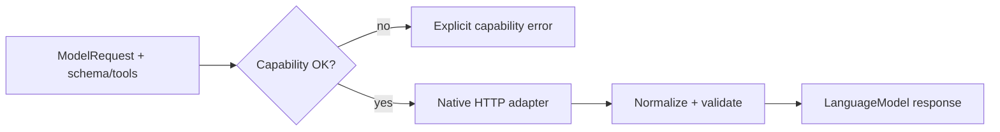

# Model-Layer Parity - Plan

## Goal Capsule

- **Objective**: The language-model layer matches what downstream features need: structured JSON from every major chat provider, complete tool calls from streams, embeddings, reasoning fields for multi-turn tool use, explicit prompt-cache controls, schema-valid tool arguments, and consistent multimodal mapping. Callers get typed results or explicit capability errors — never silent `{}` or dropped attachments.
- **Product Authority**: Area 2 of 8 from the 2026-10-04 library assessment (deferred list in the reliability pass). Area 3 decision models depend on structured output from this plan.
- **Open Blockers**: None for planning. Assumes the reliability pass (transport, stream parsers, metering) is merged or in flight.
- **Execution profile**: Test-first per capability; provider tests use real `Response` bodies from `tests/helpers/http.ts`; no live API keys required for CI.

---

## Product Contract

### Summary

Finish the toolkit plan's unfinished model layer: rename the chat contract toward `LanguageModel`, add structured output and embeddings as first-class capabilities, assemble streamed tool-call fragments in one place, carry reasoning content through message history (especially DeepSeek), expose prompt-cache breakpoints, validate tool arguments against schemas, and centralize multimodal conversion with fail-loud gaps.

Native HTTP adapters remain the default; vendor SDKs stay optional via the existing bridge.

### Problem Frame

`ModelProtocol` in `src/core/protocol.ts` exposes only `generate` and `stream`. `ModelRequest` in `src/core/types.ts` has no structured-output field, so decision models cannot be built on language models (decision plan R11/R12).

Streaming yields incremental `deltaToolCall` fragments (`src/core/types.ts:117`), but nothing assembles them into final `ToolCall[]` for consumers. OpenAI's `parseToolCalls` substitutes `{}` when JSON parsing fails (`src/providers/openai.ts:423`), which hides malformed model output.

DeepSeek reuses the OpenAI adapter (`src/providers/deepseek.ts`) and does not echo `reasoning_content` on assistant tool-call turns, so multi-turn tool loops fail with provider 400s (reliability pass deferred note).

Embeddings exist only as an optional callback type on `JITToolRetriever` (`src/agent/jit-retriever.ts`); there is no provider API.

Multimodal support is uneven: Gemini accepts any attachment with base64 data; OpenAI maps image and audio only; Anthropic maps image and document; video and URL-only attachments are dropped without error. Prompt-cache **read** metrics are parsed, but callers cannot **set** cache breakpoints (Anthropic `cache_control`, OpenAI prompt caching hints).

### Key Decisions

- **`LanguageModel` names the chat contract** (session-settled with decision plan R3 — chosen over keeping only `ModelProtocol`: aligns with Vercel AI SDK vocabulary and separates chat from future `DecisionModel`). `ModelProtocol` becomes a deprecated type alias for one release cycle in docs only; the interface is renamed to `LanguageModel`. Governs R1, R2.
- **Structured output is schema-in, validated-object-out** (chosen over returning raw JSON strings only: decision models and agents need typed payloads). JSON Schema from `@webergency-utils/typechecker` is the canonical schema type; adapters map to each vendor's wire format. Governs R3–R8.
- **Capability errors are explicit** (chosen over best-effort fallback: a provider without structured output or embeddings raises an error naming the capability and provider). Governs R7, R15, R16.
- **One stream tool-call assembler in core** (chosen over duplicating assembly in each adapter and the agent: adapters keep emitting deltas; core folds them). Governs R9–R12.
- **Invalid tool-call JSON fails the call** (chosen over `{}` defaults: matches reliability pass fail-loudly rule). Optional validation against `ToolDefinition.parameters` when tools are on the request. Governs R13–R14.
- **Reasoning is a first-class message field, not only usage tokens** (chosen over stuffing reasoning into `content`: DeepSeek requires round-tripping `reasoning_content`). Governs R17–R19.
- **Embeddings are a separate small protocol** (chosen over extending `LanguageModel` with `embed`: not every chat provider embeds; keeps metering and registry clear). Governs R20–R24.
- **Multimodal mapping lives in shared helpers** (chosen over copy-paste in eight adapters: one place to fail loudly on unsupported type/provider pairs). Governs R25–R28.
- **Native HTTP only in scope** (toolkit plan R7; SDK bridge may gain passthrough later, not required here). Governs all adapter units.

### Requirements

**Contract and naming**

- R1. The chat model interface is named `LanguageModel` and exported from `src/core/protocol.ts`. It retains `generate` and `stream` with the same semantics as today's `ModelProtocol`.
- R2. `ModelProtocol` is exported as a type alias to `LanguageModel` for internal and test imports; public docs and new code use `LanguageModel`.
- R3. `ModelRequest` accepts an optional `outputSchema` (`JsonSchema | Record<string, unknown>`) and optional `outputMode`: `'json'` | `'json_schema'` (default `'json_schema'` when a schema is present).
- R4. `ModelResponse` carries optional `structured?: unknown` when structured output was requested. The value is parsed JSON validated against `outputSchema` when provided; validation failure raises `InvalidInputError` with schema errors — never returned as success.
- R5. `LanguageModel` exposes read-only capability flags: at minimum `structuredOutput`, `embeddings`, `reasoningContent`, `promptCacheControl`, and `multimodal` (per attachment type). Flags reflect the adapter's honest support for the configured model, not runtime guesswork.
- R6. `createModel` and `ModelRegistry` return `LanguageModel`. `MeteredModel` wraps `LanguageModel` unchanged.

**Structured output**

- R7. When `outputSchema` is set and the adapter's `structuredOutput` capability is false, `generate` and `stream` fail before HTTP with an error that names `structuredOutput` and the provider.
- R8. OpenAI-compatible adapters (OpenAI, Groq, Mistral, DeepSeek) map `outputSchema` to `response_format` (`json_schema` with strict schema when supported, else `json_object` with a documented gap warning when the model rejects strict mode).
- R9. Anthropic maps `outputSchema` to the Messages API structured-output field appropriate for the model (native schema or tool-style JSON block per Anthropic docs at implementation time).
- R10. Gemini maps `outputSchema` to `generationConfig.responseSchema` (and MIME type `application/json`).
- R11. Ollama maps structured output via its native JSON/schema options when the running model supports them; otherwise fails per R7.
- R12. For streaming structured output, the final assembled text is parsed once when the stream completes; malformed JSON or schema validation failure raises — partial JSON is not returned as success (reliability pass R44 applies to stream terminators).

**Streamed tool calls**

- R13. A exported `ToolCallStreamAssembler` (or equivalent) accepts `ModelStreamChunk` iterations and produces accumulated text plus complete `ToolCall[]` when the stream ends. It concatenates `deltaToolCall.arguments` per index, parses JSON once per tool, and raises `ProviderError` on invalid JSON.
- R14. When `ModelRequest.tools` is non-empty, assembled tool arguments are validated against the matching tool's `parameters` schema; failure raises `InvalidInputError` naming the tool.
- R15. Adapters may emit a terminal chunk with `toolCalls` populated; if they do, it must match what the assembler would produce (tests assert equivalence for OpenAI and Anthropic fixtures).

**Typed tool arguments (non-streaming)**

- R16. Non-streaming `parseToolCalls` paths in OpenAI, Ollama, and shared helpers must not substitute `{}` on JSON parse failure; they raise `ProviderError` with the raw argument fragment and tool name.
- R17. Gemini and Anthropic non-stream tool calls already receive objects; if the wire payload is not an object where required, fail per R16.

**Reasoning content**

- R18. `ChatMessage` for `role: 'assistant'` may include optional `reasoningContent?: string`. Adapters populate it from provider-specific reasoning fields on **responses** (e.g. OpenAI `reasoning` models, DeepSeek `reasoning_content`).
- R19. OpenAI-compatible adapters **re-send** `reasoningContent` on assistant messages in multi-turn histories when the provider requires it (DeepSeek tool-call follow-up). Missing required echo on a configured reasoning model fails at format time with an explicit error before HTTP.
- R20. `ModelStreamChunk` may include optional `deltaReasoningContent?: string` for streaming reasoning deltas where the provider exposes them; the assembler accumulates it parallel to text.

**Embeddings**

- R21. The library defines `EmbeddingProtocol` with `embed( input: string | string[], options? ): Promise<EmbeddingResponse>` and normalized `EmbeddingResponse` (vectors, model id, usage when present, `raw`).
- R22. `createEmbeddingModel( config )` (or registry parallel to `createModel`) returns `EmbeddingProtocol` for providers that support embeddings: OpenAI, Gemini, Ollama at minimum.
- R23. Embedding calls use the same transport stack as chat (`BaseProviderAdapter.request`: signal, timeout, retry) and the same metering hooks where token usage exists.
- R24. Requesting embeddings from a provider without support fails with an error naming `embeddings`.

**Prompt cache controls**

- R25. `ChatMessage` may include optional `cacheControl?: { type: 'ephemeral' } | { type: 'ephemeral'; ttl?: '5m' | '1h' }` (Anthropic-style). Adapters that support prompt caching map it to wire breakpoints; unsupported providers ignore only when `cacheControl` is absent — if present and unsupported, fail per R7-style capability error.
- R26. OpenAI adapter maps optional request-level `promptCacheKey?: string` (on `ModelRequest`) to the provider's prompt-cache field when documented for the model.
- R27. Normalized usage continues to expose cached read/write tokens (reliability pass R26); cache **control** is separate from cache **billing**.

**Multimodal mapping**

- R28. Shared helpers convert `MessageAttachment[]` to provider parts. Unsupported combinations (e.g. video to a provider with no video API) raise before HTTP, naming attachment type and provider.
- R29. URL-only attachments: when `url` is set without `data`, adapters pass the URL form the provider accepts (OpenAI `image_url`, Gemini `fileData`/`uri` where supported); if the provider requires bytes, fail per R28.
- R30. Document/PDF attachments map on OpenAI (file API or inline per model capability), Anthropic (document block), and Gemini (`inlineData` with PDF mime). Video maps where the provider documents support; otherwise R28.
- R31. User messages with attachments but empty `content` are valid; adapters omit empty text parts rather than sending invalid payloads.

**Cross-cutting**

- R32. Every new code path follows the reliability pass fail-loudly rule: no silent drops, no default vectors, no empty tool args on parse failure.
- R33. Structured output, embeddings, and multimodal failures are covered by regression tests (characterization or red-green) per implementation unit.

### Key Flows

- F1. Structured decision-style call via language model
  - **Trigger:** caller sets `outputSchema` on `ModelRequest`.
  - **Steps:** capability check → adapter maps schema → HTTP → parse JSON → validate schema → return `structured` on `ModelResponse`.
  - **Outcome:** typed object or explicit error.
  - **Covered by:** R3–R12, R32.

- F2. Streaming agent-style tool use
  - **Trigger:** caller consumes `model.stream` with tools enabled.
  - **Steps:** foreach chunk → assembler accumulates text and tool deltas → on end, parse and validate tools → yield final `toolCalls`.
  - **Outcome:** complete tool calls or parse/validation error.
  - **Covered by:** R13–R16.

- F3. DeepSeek multi-turn tools with reasoning
  - **Trigger:** assistant message with tool calls is appended to history after tool results.
  - **Steps:** formatter includes prior `reasoningContent` on assistant turns → provider accepts follow-up request.
  - **Outcome:** no 400 for missing `reasoning_content`.
  - **Covered by:** R18–R19.

### Acceptance Examples

- AE1. Structured output on unsupported provider
  - **Covers R7.**
  - **Given:** Ollama configured with a model that does not support JSON schema mode.
  - **When:** `generate` is called with `outputSchema`.
  - **Then:** the call fails before HTTP and names `structuredOutput`.

- AE2. Valid structured object
  - **Covers R4, R8.**
  - **Given:** OpenAI adapter and a schema `{ type: 'object', properties: { label: { type: 'string' } }, required: ['label'] }`.
  - **When:** the mock response body contains matching JSON in the assistant message.
  - **Then:** `response.structured.label` is typed at compile time when using `assertSchema`, and runtime validation passes.

- AE3. Stream assembles split tool JSON
  - **Covers R13.**
  - **Given:** an OpenAI stream fixture with two indices and fragmented `arguments` strings (see `tests/providers/openai.test.ts` partial JSON chunks).
  - **When:** chunks pass through the assembler.
  - **Then:** two tools with parsed objects `{ q: ... }` and `{ id: ... }`; no partial keys returned as final.

- AE4. Malformed tool JSON
  - **Covers R16.**
  - **Given:** a non-stream response whose tool `arguments` string is `{not json`.
  - **When:** `generate` returns tool calls.
  - **Then:** `ProviderError`; arguments are not `{}`.

- AE5. DeepSeek reasoning echo
  - **Covers R19.**
  - **Given:** history with an assistant turn that has `toolCalls` and `reasoningContent: 'step plan'`.
  - **When:** the adapter formats messages for the next user/tool turn.
  - **Then:** the outbound payload includes `reasoning_content` on that assistant message.

- AE6. Unsupported attachment
  - **Covers R28.**
  - **Given:** a user message with `type: 'video'` to Ollama chat.
  - **When:** `generate` is called.
  - **Then:** error names `video` and `ollama` before fetch.

- AE7. Embeddings batch
  - **Covers R22, R23.**
  - **Given:** `createEmbeddingModel({ provider: 'openai', model: 'text-embedding-3-small' })`.
  - **When:** `embed(['a', 'b'])` against a mock `/embeddings` response.
  - **Then:** two vectors of equal dimension; usage recorded when present.

- AE8. Cache breakpoint on unsupported provider
  - **Covers R25.**
  - **Given:** Groq chat with `cacheControl: { type: 'ephemeral' }` on a system message.
  - **When:** `generate` runs.
  - **Then:** fails with prompt-cache capability error (Groq does not support Anthropic-style breakpoints).

### Success Criteria

- Decision plan R11 can be implemented without adding new request fields beyond what this plan adds.
- Every defect class listed in the problem frame has a requirement and a regression test.
- Provider suite stays offline (mock `Response` only).

### Scope Boundaries

**In scope**

- All seven default chat providers in `ModelRegistry`.
- Core types, protocol rename, assembler, multimodal helpers, embeddings for OpenAI/Gemini/Ollama.
- Metering passthrough for embedding usage where available.

**Deferred**

- SDK bridge structured output and embeddings passthrough.
- Agent loop switching from `generate` to `stream` (agent capabilities area).
- Image generation, audio TTS, batch API, fine-tuning endpoints.
- Automatic model listing / capability probing against live APIs.
- Voyage/Cohere embedding providers unless OpenAI-compatible endpoint is configured via `baseUrl`.

**Out of scope**

- Decision models, Jev, workflow decision steps (Area 3).
- Changing retry or pricing behavior (Area 1).

### Dependencies / Assumptions

- Reliability pass U2–U4 merged: stream terminators, `BaseProviderAdapter.request`, `MeteredModel`.
- Package unpublished: renaming `ModelProtocol` → `LanguageModel` needs no deprecation shim in code beyond the alias (R2).
- JSON Schema validation uses existing `@webergency-utils/typechecker` (`src/core/schema.ts`).
- Provider wire formats taken from official docs at implementation time; tests lock behavior with fixtures, not live docs.

### Outstanding Questions

**Deferred to implementation**

- Whether OpenAI strict `json_schema` is always enabled or gated by model id list.
- Gemini file-URI attachments vs inline-only for PDFs on `v1beta`.
- Whether `createEmbeddingModel` shares `ModelConfig` or a slim `EmbeddingModelConfig` (recommend shared `ModelConfig` with ignored chat fields).

### Sources / Research

- Toolkit plan R1–R2 (unfinished structured output and multimodal): `docs/plans/2026-09-18-1757-feat-ai-toolkit-plan.md`
- Decision plan R3, R11–R12 dependency: `docs/plans/2026-10-05-1153-feat-decision-models-plan.md`
- Reliability deferred list: `docs/plans/2026-10-05-1153-fix-reliability-pass-plan.md` (lines 256–262)
- Current contract: `src/core/protocol.ts`, `src/core/types.ts`
- OpenAI tool parse silent default: `src/providers/openai.ts` (~402–426)
- DeepSeek adapter: `src/providers/deepseek.ts`
- JIT embedder hook: `src/agent/jit-retriever.ts`

---

## Planning Contract (KTD)

| Topic | Decision |
| --- | --- |
| Schema type | `@webergency-utils/typechecker` `JsonSchema` everywhere |
| Structured stream | Accumulate text in assembler; parse JSON once at end |
| Tool JSON failure | `ProviderError` (wire/parse), `InvalidInputError` (schema) |
| Capability surface | Boolean flags on adapter instance, set per provider class |
| Embeddings entry | `createEmbeddingModel` + `EmbeddingProtocol` |
| Multimodal | `src/core/multimodal.ts` (new) consumed by adapters |

---

## Implementation Units

### U1. `LanguageModel` rename and request/response extensions

- **Goal:** Name the chat contract `LanguageModel`, extend types for structured output, reasoning, and cache hints without breaking imports.
- **Requirements:** R1–R6, R18, R25–R26, R32
- **Dependencies:** Reliability pass merged (types stable).
- **Files:** `src/core/protocol.ts`, `src/core/types.ts`, `src/core/index.ts`, `src/providers/metered.ts`, `src/providers/registry.ts`, `src/agent/agent.ts`, `tests/core/types.test.ts` (new)
- **Approach:**
  1. Rename interface to `LanguageModel`; export `ModelProtocol = LanguageModel`.
  2. Add `outputSchema`, `outputMode`, `promptCacheKey`, message `reasoningContent`, message `cacheControl`.
  3. Add `structured` to `ModelResponse`; `deltaReasoningContent` to `ModelStreamChunk`.
  4. Add capability getters on `BaseProviderAdapter` with provider-specific defaults.
  5. Update `AgentConfig.model`, registry return types, and test mocks to `LanguageModel`.
- **Test scenarios:**
  - Type-only: `ModelProtocol` assignable to `LanguageModel`.
  - Capability flags false for a stub adapter until overridden.
  - Message with `reasoningContent` round-trips through JSON clone in checkpoint types (compile + serialize test).

### U2. Structured output (all chat providers)

- **Goal:** Schema-in, validated-object-out on `generate`; stream path validates at end.
- **Requirements:** R3–R12, R7, R32, R33
- **Dependencies:** U1
- **Files:** `src/core/structured-output.ts` (new), `src/providers/openai.ts`, `src/providers/anthropic.ts`, `src/providers/gemini.ts`, `src/providers/ollama.ts`, `src/providers/groq.ts`, `src/providers/mistral.ts`, `src/providers/deepseek.ts`, `tests/providers/structured-output.test.ts` (new), extend `tests/providers/openai.test.ts`, `anthropic.test.ts`, `gemini.test.ts`, `ollama.test.ts`
- **Approach:**
  1. Shared helper: build provider payload from `outputSchema` / `outputMode`; parse and `validateSchema` response text or dedicated structured field.
  2. OpenAI family: `response_format` mapping (R8); DeepSeek/Groq/Mistral inherit or override capability flags.
  3. Anthropic + Gemini native mappings (R9–R10); Ollama capability gate (R11).
  4. Stream: integrate with U3 assembler to parse after `[DONE]` / message_stop.
- **Test scenarios:**
  - Covers AE1, AE2.
  - Schema validation failure throws `InvalidInputError` with path.
  - Stream missing terminator still throws (reuses R44 behavior).

### U3. Tool-call stream assembler and strict argument parsing

- **Goal:** One assembler for deltas; non-stream parsers fail on bad JSON; optional schema validation against request tools.
- **Requirements:** R13–R17, R32, R33
- **Dependencies:** U1
- **Files:** `src/core/tool-stream.ts` (new), `src/core/index.ts`, `src/providers/openai.ts`, `src/providers/ollama.ts`, `src/providers/anthropic.ts`, `tests/core/tool-stream.test.ts` (new), update `tests/providers/openai.test.ts`
- **Approach:**
  1. Implement index-keyed accumulation for id, name, arguments string.
  2. Export helper `assembleStream( chunks ): { text, reasoning, toolCalls }`.
  3. Replace `{}` catch blocks in OpenAI/Ollama `parseToolCalls` with `ProviderError`.
  4. When `request.tools` present, validate each assembled call via `validateSchema`.
  5. Optionally emit final `toolCalls` on last stream chunk in OpenAI adapter for parity (R15).
- **Test scenarios:**
  - Covers AE3, AE4.
  - Tool schema mismatch throws `InvalidInputError` naming tool.
  - Multi-index Anthropic `input_json_delta` fixture assembles correctly.

### U4. Reasoning content and DeepSeek history formatting

- **Goal:** Surface reasoning on responses; echo required fields on subsequent requests.
- **Requirements:** R17–R20, R19, R32, R33
- **Dependencies:** U1, U3 (stream reasoning accumulation)
- **Files:** `src/providers/openai.ts`, `src/providers/deepseek.ts`, `src/core/tool-stream.ts`, `tests/providers/deepseek.test.ts` (new), `tests/providers/openai-reasoning.test.ts` (new)
- **Approach:**
  1. Parse `reasoning_content` / reasoning blocks from generate and stream into `reasoningContent` / `deltaReasoningContent`.
  2. DeepSeek override `formatSingleMessage` for assistant + tool history (R19).
  3. Pre-flight error when history requires echo but assistant message lacks `reasoningContent`.
- **Test scenarios:**
  - Covers AE5.
  - Formatter snapshot test for multi-turn tool history outbound JSON.
  - Stream accumulates `deltaReasoningContent` separately from text.

### U5. Embeddings protocol and provider adapters

- **Goal:** Normalized embed API for OpenAI, Gemini, Ollama with transport and metering hooks.
- **Requirements:** R20–R24, R32, R33
- **Dependencies:** U1, reliability pass transport
- **Files:** `src/core/embeddings.ts` (new), `src/core/protocol.ts` (or `embeddings-protocol.ts`), `src/providers/openai-embeddings.ts` (new), `src/providers/gemini-embeddings.ts` (new), `src/providers/ollama-embeddings.ts` (new), `src/providers/registry.ts`, `src/providers/index.ts`, `src/agent/jit-retriever.ts` (optional factory helper), `tests/providers/embeddings.test.ts` (new)
- **Approach:**
  1. Define `EmbeddingProtocol`, `EmbeddingResponse`, `createEmbeddingModel`.
  2. Implement native HTTP for `/embeddings`, Gemini `embedContent`, Ollama `/api/embeddings`.
  3. Register embedding factories; chat providers without embeddings fail `createEmbeddingModel` at registry level.
  4. Document optional `embedder: createEmbeddingModel(...).embed` for JIT retriever.
- **Test scenarios:**
  - Covers AE7.
  - Unknown provider for embeddings throws registry error.
  - Dimension mismatch not applicable at embed layer (vector store still enforces R37).

### U6. Prompt cache controls

- **Goal:** Callers set cache breakpoints; adapters map or fail loudly.
- **Requirements:** R25–R27, R32, R33
- **Dependencies:** U1
- **Files:** `src/providers/anthropic.ts`, `src/providers/openai.ts`, `src/providers/gemini.ts`, `tests/providers/cache-control.test.ts` (new)
- **Approach:**
  1. Map message `cacheControl` to Anthropic `cache_control` blocks on system/user content.
  2. Map `promptCacheKey` on OpenAI requests when supported.
  3. Gemini explicit cached content API deferred unless trivial; if `cacheControl` set on Gemini, fail capability until implemented.
  4. Capability flag `promptCacheControl` true only where mapping exists.
- **Test scenarios:**
  - Covers AE8.
  - Anthropic system block includes `cache_control` ephemeral when requested.
  - Usage fields still populate cached read tokens on mocked responses (smoke).

### U7. Multimodal mapping helpers

- **Goal:** Centralize attachment conversion; support URL and document/video where providers allow; fail before HTTP otherwise.
- **Requirements:** R28–R31, R32, R33
- **Dependencies:** U1
- **Files:** `src/core/multimodal.ts` (new), `src/providers/openai.ts`, `src/providers/anthropic.ts`, `src/providers/gemini.ts`, `src/providers/ollama.ts`, `tests/core/multimodal.test.ts` (new), `tests/providers/multimodal.test.ts` (new)
- **Approach:**
  1. `assertAttachmentSupport(provider, attachment)` and per-provider mappers returning wire parts.
  2. OpenAI: document/file paths per model; audio/video per current API surface.
  3. Anthropic: document + image blocks; video fail unless supported.
  4. Gemini: inlineData + file URI when allowed.
  5. Ollama: images only; video raises R28.
  6. Empty content + attachments only messages format correctly (R31).
- **Test scenarios:**
  - Covers AE6.
  - URL-only image on OpenAI produces `image_url` without base64.
  - PDF document on Anthropic produces document block with correct media_type.

---

## Verification Matrix

| Requirement group | Primary tests |
| --- | --- |
| R1–R6 | `tests/core/types.test.ts` |
| R3–R12 | `tests/providers/structured-output.test.ts` |
| R13–R17 | `tests/core/tool-stream.test.ts`, provider tool tests |
| R17–R20 | `tests/providers/deepseek.test.ts` |
| R20–R24 | `tests/providers/embeddings.test.ts` |
| R25–R27 | `tests/providers/cache-control.test.ts` |
| R28–R31 | `tests/core/multimodal.test.ts`, `tests/providers/multimodal.test.ts` |

Run order: U1 → U3 and U6 and U7 in parallel where possible → U2 → U4 → U5 (U5 independent after U1).

---

## How This Work Fits Together

- **Reliability pass (Area 1):** prerequisite transport and stream terminators.
- **Decision models (Area 3):** blocked on U2 structured output and U1 `LanguageModel` naming (decision plan R3, R11–R12).
- **Agent capabilities (Area 4):** can consume U3 assembler when adding agent streaming later.
